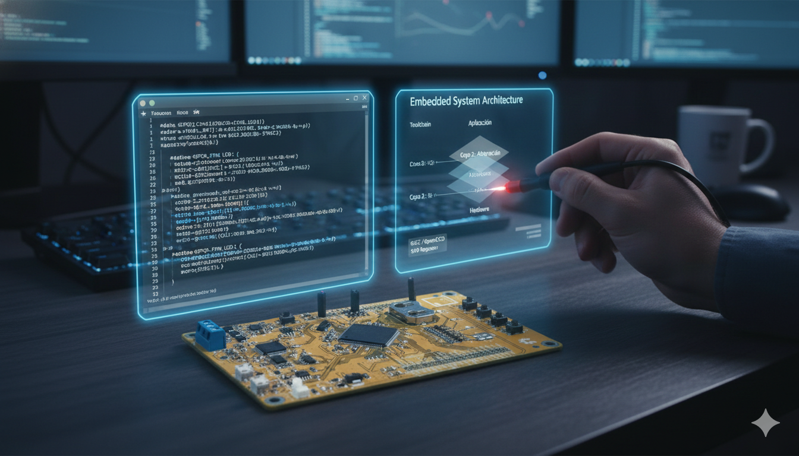
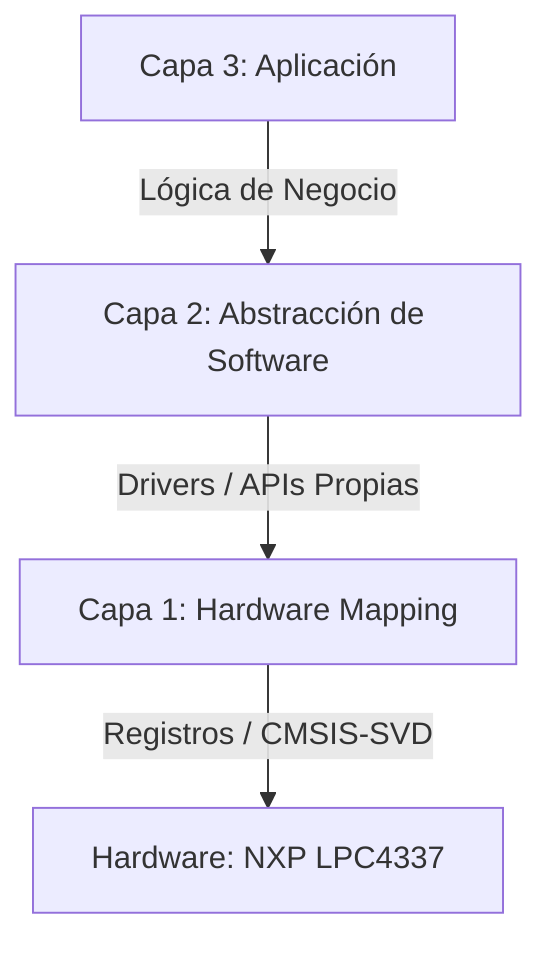

# 🧠 Edu-CIAA-LPC4337-LPCOpen-Lab
### Orquestación de Sistemas Embebidos con Toolchain Independiente

---

"La potencia de la EDU-CIAA reside en la transparencia de su arquitectura. Como autodidacta, entiendo que el verdadero dominio sobre el LPC4337 no se encuentra en manuales rígidos, sino en la libertad de explorar sus registros sin filtros. Es el paso necesario para transformar una placa de desarrollo en un instrumento de ingeniería propia."

# 🚀 Desarrollo de Sistemas Embebidos Profesionales: NXP LPC4337

Este repositorio documenta el estudio profundo y la implementación de firmware sobre la arquitectura **Cortex-M4/M0 (Dual-Core)** del chip NXP LPC4337, corazón de la placa **EDU-CIAA**. 

El enfoque principal es el dominio del hardware mediante un **Toolchain Local Independiente**, prescindiendo de la opacidad de los IDEs comerciales para obtener un control total sobre el silicio.

---

## 🏗️ Arquitectura del Software (Modelo de 3 Capas)

Para garantizar la robustez, portabilidad y facilidad de depuración, el firmware se organiza en tres niveles de abstracción:

* **Capa 1 (Hardware Mapping):** Acceso directo a registros mediante el uso de máscaras y punteros. Implementa la validación bit a bit utilizando descriptores **SVD**, asegurando que la configuración del silicio sea exacta.
* **Capa 2 (Abstracción):** Creación de APIs y Drivers que encapsulan la complejidad del hardware (ej. `gpio_init()`, `timer_start()`). Esta capa permite que la aplicación sea agnóstica al pin físico, facilitando la migración y el mantenimiento.
* **Capa 3 (Aplicación):** Lógica de alto nivel y **Máquinas de Estado Finitos (MEF)** que orquestan el comportamiento del sistema, interactuando exclusivamente con las APIs de la Capa 2.

---

## 🛠️ Toolchain: Soberanía Técnica sin IDEs

La potencia de este flujo de trabajo reside en su **independencia**. Al prescindir de entornos "caja negra", el desarrollador recupera la soberanía sobre cada etapa del proceso crítico:

* **Compilador (GCC Arm):** Gestión directa del proceso de *linking* y control total sobre los mapas de memoria (Flash y RAM).
* **Depuración (OpenOCD + GDB):** Control total del protocolo **JTAG/SWD**. Se ha implementado un *bypass* de reset manual para estabilizar la comunicación con el núcleo **Cortex-M4**, mitigando errores de protocolo (como el recurrente **Error FC**) típicos de sistemas asimétricos.
* **Introspección (CMSIS-SVD):** Visualización de periféricos en tiempo real y sin intermediarios. Esto permite auditar el estado del **SCU** (System Control Unit) y la matriz de registros del **LPC4337** de forma transparente.

> *"La potencia de un desarrollo no reside en la interfaz del IDE, sino en la transparencia del Toolchain. Un entorno independiente es la garantía de que el conocimiento pertenece al desarrollador y no a la herramienta."*

---

## 📋 Laboratorios e Implementaciones

| Nivel | Proyecto | Descripción Técnica |
| :--- | :--- | :--- |
| **Básico** | [01_GPIO_SCU_Mux](./projects/01_Basico/01_GPIO_SCU_Mux) | Multiplexación de pines (SCU) y control de flujo digital. |
| **Intermedio** | [02_Timers_Interrupts](./projects/02_Intermedio/02_Timers) | Gestión de tiempos precisos y concurrencia por hardware. |
| **Avanzado** | [03_DMA_DualCore](./projects/03_Avanzado/03_DMA) | Transferencia masiva de datos y orquestación de núcleos. |

---

## 🚀 Guía Rápida de Inicio

1.  **Configurar Entorno:** Consulta la [Guía del Toolchain Local](./tools/README.md) para preparar los binarios.
2.  **Compilar:** Presiona `F3` (Ejecuta el comando `MAKE ALL`).
3.  **Depurar:** Presiona `F5` para iniciar la sesión de GDB con visualización de periféricos activa.

---
💻 **Desarrollo de Sistemas Embebidos Profesionales | LPC4337 - NXP**