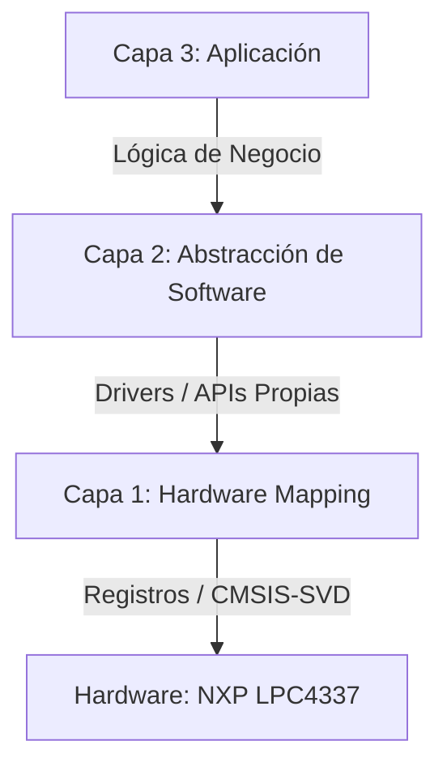

# 🧠 Edu-CIAA-LPC4337-LPCOpen-Lab

---

*"La potencia de la **EDU-CIAA** reside en la transparencia de su arquitectura. Como autodidacta, entiendo que el verdadero dominio sobre el **LPC4337** no se encuentra en manuales rígidos, sino en la libertad de explorar sus registros sin filtros. Es el paso necesario para transformar una placa de desarrollo en un instrumento de ingeniería propia."*

# 🚀 Desarrollo de Sistemas Embebidos Profesionales: NXP LPC4337

Este repositorio documenta el estudio profundo y la implementación de firmware sobre la arquitectura **Cortex-M4/M0 (Dual-Core)** del chip NXP LPC4337, corazón de la placa **EDU-CIAA**. 

El enfoque principal es el dominio del hardware mediante un **Toolchain Local Independiente**, prescindiendo de la opacidad de los IDEs comerciales para obtener un control total sobre el silicio.

---

## 🏗️ Arquitectura del Software (Modelo de 3 Capas)

Para garantizar la robustez y portabilidad, el firmware se organiza en tres niveles de abstracción:

Para garantizar la robustez, portabilidad y facilidad de depuración, el firmware se organiza en tres niveles de abstracción:

* **Capa 1 (Hardware Mapping):** Acceso directo a registros mediante el uso de máscaras y punteros. Implementa la validación bit a bit utilizando descriptores **SVD**, asegurando que el multiplexado del **SCU** y la configuración del silicio sean exactos.
* **Capa 2 (Abstracción):** Creación de APIs y Drivers que encapsulan la complejidad del hardware (ej. `gpio_init()`, `timer_start()`). Esta capa permite que la aplicación sea agnóstica al pin físico, facilitando la migración y el mantenimiento.
* **Capa 3 (Aplicación):** Lógica de alto nivel y **Máquinas de Estado Finitos (MEF)** que orquestan el comportamiento del sistema, interactuando exclusivamente con las APIs de la Capa 2.

---

## 📋 Plan de Carrera: Laboratorios e Implementaciones

Para dominar el **LPC4337**, el camino se divide en tres niveles de complejidad creciente, enfocados en la **Soberanía Técnica** y la **Arquitectura de 3 Capas**.

### 🏗️ Nivel Básico - Fundamentos y Registro Directo
*El objetivo es dominar la Capa 1 y el ruteo interno del silicio mediante el SCU.*

* **SCU & GPIO Mastery:** Configuración de la matriz de conmutación (pin muxing), Pull-ups, y Open-drain.
* **Modularidad de Capas:** Separación estricta entre el mapeo de registros (**Capa 1**) y el driver funcional (**Capa 2**).
* **Lógica No Bloqueante:** Implementación de MEFs (Máquinas de Estado) y antirebote (debounce) sin `delay()`.
---

### ⚙️ Nivel Intermedio - Eventos y Hardware Autónomo
*Transición hacia el procesamiento basado en eventos y autonomía del hardware.*

* **NVIC & EXTI:** Gestión de interrupciones externas para eventos asíncronos (TEC1-4).
* **Timers & RIT:** Uso del *Repetitive Interrupt Timer* y Timers de 32 bits para el "Heartbeat" del sistema.
* **Comunicaciones Serie:** UART con **Ring Buffers** y modulación PWM mediante el bloque **SCTimer**.
* **HMI & Buses:** Manejo de displays y protocolos I2C/SPI bajo arquitectura de 3 capas.

---

### 🚀 Nivel Avanzado - High Performance & Dual-Core
*Arquitecturas de alto rendimiento: Gestión masiva de datos y multiprocesamiento.*

* **GPDMA Mastery:** Transferencias masivas memoria-periférico con **Zero CPU Load**.
* **Dual-Core Orchestration:** Despertar al núcleo **Cortex-M0** para tareas de E/S mientras el **M4** procesa datos.
* **Adquisición de Datos:** ADC de alta velocidad sincronizado por hardware y procesamiento de señales.
* **RTOS & Robustez:** Multitarea profesional utilizando FreeRTOS integrado en el Toolchain local.

---

## 🚀 Guía Rápida de Inicio

1.  **Configurar Entorno:** Consulta la [Guía del Toolchain Local](./tools/README.md) para preparar drivers (**Zadig**) y binarios.
2.  **Limpiar y Compilar:** Presiona `F3` (Ejecuta `MAKE CLEAN`) y luego `F4` (Ejecuta `MAKE ALL`).
3.  **Flashear:** Presiona `F5` para grabar el binario directamente en la memoria Flash.
4.  **Depurar:** Presiona `F6` para iniciar el servidor de debug (**OpenOCD**) y utiliza el panel de VS Code para conectar la sesión con visualización de registros activa.

---