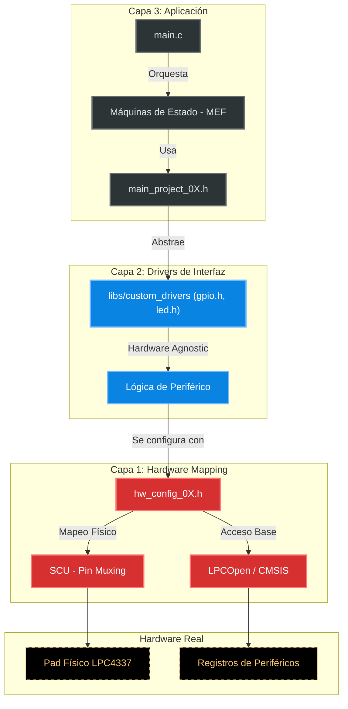

# 🧠 Edu-CIAA-LPC4337-LPCOpen-Lab

---

*"La potencia de la **EDU-CIAA** reside en la transparencia de su arquitectura. Como autodidacta, entiendo que el verdadero dominio sobre el **LPC4337** no se encuentra en manuales rígidos, sino en la libertad de explorar sus registros sin filtros. Es el paso necesario para transformar una placa de desarrollo en un instrumento de ingeniería propia."*

# 🚀 Desarrollo de Sistemas Embebidos Profesionales: NXP LPC4337

Este repositorio documenta el estudio profundo y la implementación de firmware sobre la arquitectura **Cortex-M4/M0 (Dual-Core)** del chip NXP LPC4337, corazón de la placa **EDU-CIAA**. 

El enfoque principal es el dominio del hardware mediante un **Toolchain Local Independiente** y el aprovechamiento del framework **LPCOpen**, prescindiendo de la opacidad de los IDEs comerciales para obtener un control total sobre el silicio.

---

## 🏗️ Arquitectura del Software (Modelo de 3 Capas)
Para garantizar la robustez y portabilidad, el firmware se organiza en tres niveles de abstracción:

```mermaid
graph TD
    %% Definición de Nodos de Capas
    subgraph Capa_3 [Capa 3: Aplicación]
        A[main.c] -->|Orquesta| B[Máquinas de Estado - MEF]
        B -->|Usa| C[main_project_0X.h]
    end

    subgraph Capa_2 [Capa 2: Drivers de Interfaz]
        C -->|Abstrae| D["libs/custom_drivers (gpio.h, led.h)"]
        D -->|Hardware Agnostic| E[Lógica de Periférico]
    end

    subgraph Capa_1 [Capa 1: Hardware Mapping]
        E -->|Se configura con| F[hw_config_0X.h]
        F -->|Mapeo Físico| G[SCU - Pin Muxing]
        F -->|Acceso Base| H[LPCOpen / CMSIS]
    end

    subgraph Silicio [Hardware Real]
        G --> I[Pad Físico LPC4337]
        H --> J[Registros de Periféricos]
    end

    %% Estilos Profesionales
    classDef capa3 fill:#2d3436,stroke:#636e72,color:#dfe6e9,stroke-width:2px;
    classDef capa2 fill:#0984e3,stroke:#74b9ff,color:#fff,stroke-width:2px;
    classDef capa1 fill:#d63031,stroke:#ff7675,color:#fff,stroke-width:2px;
    classDef hardware fill:#000,stroke:#fdcb6e,color:#fdcb6e,stroke-dasharray: 5 5;

    class A,B,C capa3;
    class D,E capa2;
    class F,G,H capa1;
    class I,J hardware;
```

---

## 🏗️ Arquitectura del Software (Modelo de 3 Capas)
*Actualización: Implementación de Espacios de Trabajo Multi-Proyecto para la EDU-CIAA.*

* **Capa 1: Hardware Mapping (`hw_config_0X.h`):** Es el **nexo físico** del sistema. Cada proyecto posee su propio archivo de configuración numerado para evitar colisiones de IntelliSense y garantizar la unicidad de los símbolos. Aquí reside la *"verdad del silicio"*: matrices de estructuras `static const` que definen pines, puertos y modos de función SCU para ser inyectados en los drivers.

* **Capa 2: Drivers de Interfaz (`libs/custom_drivers`):** Son componentes de software **reutilizables y portables**. Estos drivers son agnósticos al hardware; no conocen números de pines, solo entienden comportamientos (ej: `LED_Set`). Reciben las estructuras de la Capa 1 y operan el hardware mediante las bibliotecas base de LPCOpen/CMSIS.

* **Capa 3: Aplicación (`main.c` / `main_project_0X.h`):** Contiene la **lógica de negocio** y las Máquinas de Estados Finitos (MEF). Al utilizar headers únicos por proyecto, se garantiza una navegación precisa en el IDE y un código minimalista que solo "habla" en términos semánticos de la aplicación.

---

## 📁 Estructura del Repositorio

La organización del proyecto sigue una jerarquía de capas diseñada para garantizar la portabilidad y el desacoplamiento entre el silicio (LPC4337) y la aplicación final.

* **[`/projects`](./projects):** Directorio de laboratorios prácticos. Cada uno cuenta con su par de archivos de configuración exclusivos para asegurar la independencia técnica:
    * `main_project_0X.h`: Interfaz semántica y prototipos de la aplicación.
    * `hw_config_0X.h`: Mapeo físico y descriptores de hardware específicos del laboratorio.
* **[`/libs`](./libs):** El núcleo del sistema y recursos compartidos.
    * `lpc_open` / `cmsis`: Framework base de NXP y definiciones de registros del núcleo ARM.
    * **[`custom_drivers`](./libs/custom_drivers):** Drivers de autoría propia (GPIO, LED, SysTick) que implementan la **Arquitectura de 3 Capas**.
* **[`/docs`](./docs):** **Documentación Técnica Detallada.** Análisis de registros, diagramas de flujo y robustez de cada módulo:
* **[`/tools`](./tools):** Scripts de automatización, configuraciones de OpenOCD y utilidades del toolchain local (**GCC + GDB**).

---
## 📋 Plan de Carrera: Hoja de Ruta Tecnológica

El dominio del **LPC4337** se estructura en tres niveles evolutivos, diseñados para escalar desde el control del silicio hasta arquitecturas de alto rendimiento.

### 🟢 Nivel 01: Fundamentos y Abstracción de Hardware
*Focus: Capa 1 y Capa 2. Dominio del SCU, GPIO y lógica no bloqueante (MEF).*
> **Meta:** Control total del ruteo interno del chip y creación de drivers HAL propietarios.

### 🟡 Nivel 02: Autonomía y Periféricos de Precisión
*Focus: Eventos asíncronos y procesamiento independiente del CPU.*
> **Meta:** Implementación de Timers, ADC (Burst Mode), protocolos serie (UART/I2C/SPI) e interrupciones (NVIC).

### 🔴 Nivel 03: High Performance & Dual-Core
*Focus: Maximización del ancho de banda y procesamiento paralelo.*
> **Meta:** Gestión masiva de datos con GPDMA, orquestación M4/M0 y sistemas de tiempo real (RTOS).

---

## 🚀 Guía Rápida de Inicio

Para operar el laboratorio, utiliza los **botones de acceso rápido** ubicados en la **Barra de Estado** (parte inferior de VS Code). También puedes usar los atajos de teclado vinculados.

1.  **Configurar Entorno:** Consulta la [Guía del Toolchain Local](./tools/README.md) para preparar drivers (**Zadig**) y binarios.
2.  **Limpiar Laboratorio:** Haz clic en el botón **`🧹 CLEAN`** (o presiona `F3`). Esto elimina archivos de objetos previos y asegura una compilación limpia.
3.  **Compilar Proyecto:** Haz clic en **`🛠️ BUILD`** (o presiona `F4`). El sistema te pedirá seleccionar el laboratorio (ej. `01_GPIO`). El binario se generará en la carpeta `out/`.
4.  **Grabar (Flash):** Haz clic en **`🚀 FLASH`** (o presiona `F5`). Se compilará el código automáticamente y se grabará en la Flash Bank A de la EDU-CIAA.
5.  **Depurar (Debug):** Haz clic en el icono del **Bicho Rojo** en la barra lateral o presiona `F6`. Esto lanza **OpenOCD** y habilita la vista de registros (**XPeripherals**) para inspeccionar el hardware en tiempo real.

> **Nota:** Al presionar cualquier botón de acción, VS Code desplegará un menú superior para que elijas sobre qué proyecto (01, 02, 03, etc.) deseas trabajar. Esto permite mantener un solo espacio de trabajo para todos los laboratorios de la cursada.

---

## 📚 Referencias y Documentación Técnica

Para el desarrollo de este ecosistema se ha consultado la documentación oficial de los fabricantes y literatura de referencia en sistemas embebidos de alto rendimiento.

### 📑 Documentación del Silicio (NXP)
* **[LPC43xx User Manual (UM10503)](https://www.nxp.com/webapp/sps/download/preDownload.jsp?render=true):** La biblia del LPC4337. Detalla el funcionamiento de cada periférico, registros y la matriz de conmutación SCU.
* **[LPC4337 Datasheet](https://www.nxp.com/docs/en/data-sheet/LPC435X_3X_2X_1X.pdf):** Especificaciones eléctricas, tiempos y diagramas de pines de la arquitectura Dual-Core.
* **[LPCOpen Software Development Platform](https://www.nxp.com/design/design-center/software/software-library/lpcopen-software-development-platform-lpc43xx:LPCOPEN-SOFTWARE-FOR-LPC43XX):** Repositorio oficial de drivers y ejemplos de abstracción de hardware.

### 🧠 Arquitectura ARM Cortex-M
* **[Cortex-M4 Technical Reference Manual](https://developer.arm.com/documentation/100166/latest/):** Detalle del núcleo, el set de instrucciones Thumb-2 y la unidad de punto flotante (FPU).
* **[Definitive Guide to Arm Cortex-M3 and Cortex-M4 Processors](https://www.sciencedirect.com/book/9780124080829/the-definitive-guide-to-arm-cortex-m3-and-cortex-m4-processors):** (Joseph Yiu) Referencia fundamental para entender el manejo de excepciones, el NVIC y el arranque del sistema.

### 🛠️ Herramientas y Estándares
* **[GNU Arm Embedded Toolchain](https://developer.arm.com/Tools%20and%20Software/GNU%20Toolchain):** Documentación oficial del compilador GCC y las opciones de optimización para Cortex-M.
* **[OpenOCD Documentation](https://openocd.org/doc/html/index.html):** Guía para la configuración de scripts JTAG/SWD y comandos de depuración.
* **[CMSIS-SVD Standard](https://arm-software.github.io/CMSIS_5/SVD/html/index.html):** Estándar de archivos para la descripción de periféricos en tiempo de depuración.

### 🎓 Recursos de la Comunidad EDU-CIAA
* **[Proyecto CIAA - Firmware](https://proyecto-ciaa.com.ar/):** Documentación del ecosistema nacional, esquemáticos de la placa y guías de inicio rápido.

---

## ⚖️ Licencia

Este proyecto está bajo la Licencia **MIT**. Eres libre de usar, copiar, modificar y distribuir el código, siempre que se mantenga la nota de copyright y el aviso de permiso en todas las copias. Consulta el archivo [LICENSE](./LICENSE) para más detalles.

---

🛠️ **Carlos** | Estudiante de Ing. Electrónica @UTN_FRT.
🚀 Apasionado Autodidacta por los Sistemas Embebidos.