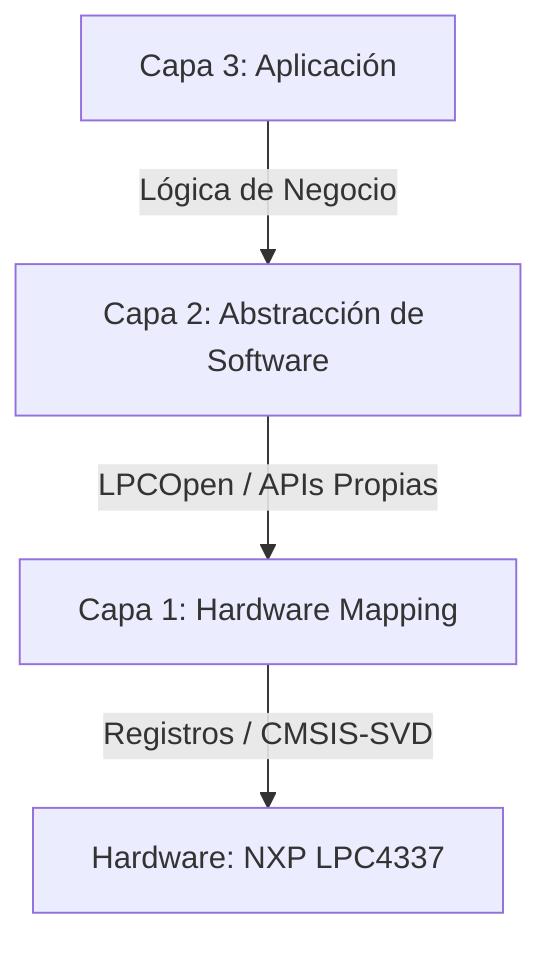

# 🧠 Edu-CIAA-LPC4337-LPCOpen-Lab

---

*"La potencia de la **EDU-CIAA** reside en la transparencia de su arquitectura. Como autodidacta, entiendo que el verdadero dominio sobre el **LPC4337** no se encuentra en manuales rígidos, sino en la libertad de explorar sus registros sin filtros. Es el paso necesario para transformar una placa de desarrollo en un instrumento de ingeniería propia."*

# 🚀 Desarrollo de Sistemas Embebidos Profesionales: NXP LPC4337

Este repositorio documenta el estudio profundo y la implementación de firmware sobre la arquitectura **Cortex-M4/M0 (Dual-Core)** del chip NXP LPC4337, corazón de la placa **EDU-CIAA**. 

El enfoque principal es el dominio del hardware mediante un **Toolchain Local Independiente** y el aprovechamiento del framework **LPCOpen**, prescindiendo de la opacidad de los IDEs comerciales para obtener un control total sobre el silicio.

---

## 🏗️ Arquitectura del Software (Modelo de 3 Capas)

Para garantizar la robustez y portabilidad, el firmware se organiza en tres niveles de abstracción:

```mermaid
graph TD
    A[Capa 3: Aplicación] -->|Lógica de Negocio| B[Capa 2: Abstracción de Software]
    B -->|LPCOpen / APIs Propias| C[Capa 1: Hardware Mapping]
    C -->|Registros / CMSIS-SVD| D[Hardware: NXP LPC4337]
```

Para garantizar la robustez, portabilidad y facilidad de depuración, el firmware se organiza en tres niveles de abstracción:

* **Capa 1 (Hardware Mapping):** Acceso directo a registros mediante el uso de máscaras y punteros. Implementa la validación bit a bit utilizando descriptores **SVD**, asegurando que el multiplexado del **SCU** (System Control Unit) y la configuración del silicio sean exactos y libres de efectos colaterales.

* **Capa 2 (Abstracción):** Integración del framework **LPCOpen** y creación de **APIs/Drivers propios** que encapsulan la complejidad del hardware (ej. `gpio_init()`, `timer_start()`). Esta capa actúa como un puente que permite que la aplicación sea agnóstica al pin físico, facilitando la migración del código y el mantenimiento a largo plazo.

* **Capa 3 (Aplicación):** Lógica de alto nivel y **Máquinas de Estado Finitos (MEF)** que orquestan el comportamiento del sistema. Se comunica exclusivamente con las APIs de la Capa 2, garantizando que un cambio en el hardware no afecte la lógica de negocio.

---

## 📋 Plan de Carrera: Laboratorios e Implementaciones

Para dominar el **LPC4337**, el camino se divide en tres niveles de complejidad creciente, enfocados en la **Soberanía Técnica** y la **Arquitectura de 3 Capas**.

### 🏗️ Nivel Básico - Fundamentos y Registro Directo
*El objetivo es dominar la Capa 1 y el ruteo interno del silicio mediante el SCU.*

* **SCU & GPIO Mastery:** Configuración de la matriz de conmutación (pin muxing), Pull-ups, y Open-drain.
* **Modularidad de Capas:** Separación estricta entre el mapeo de registros (**Capa 1**) y el driver funcional (**Capa 2**).
* **Lógica No Bloqueante:** Implementación de MEFs (Máquinas de Estado) y antirebote (debounce) sin `delay()`.
---

### ⚙️ Nivel Intermedio - Eventos y Hardware Autónomo
*Transición hacia el procesamiento basado en eventos y autonomía del hardware.*

* **NVIC & EXTI:** Gestión de interrupciones externas para eventos asíncronos (TEC1-4).
* **Timers & RIT:** Uso del *Repetitive Interrupt Timer* y Timers de 32 bits para el "Heartbeat" del sistema.
* **Comunicaciones Serie:** UART con **Ring Buffers** y modulación PWM mediante el bloque **SCTimer**.
* **HMI & Buses:** Manejo de displays y protocolos I2C/SPI bajo arquitectura de 3 capas.

---

### 🚀 Nivel Avanzado - High Performance & Dual-Core
*Arquitecturas de alto rendimiento: Gestión masiva de datos y multiprocesamiento.*

* **GPDMA Mastery:** Transferencias masivas memoria-periférico con **Zero CPU Load**.
* **Dual-Core Orchestration:** Despertar al núcleo **Cortex-M0** para tareas de E/S mientras el **M4** procesa datos.
* **Adquisición de Datos:** ADC de alta velocidad sincronizado por hardware y procesamiento de señales.
* **RTOS & Robustez:** Multitarea profesional utilizando FreeRTOS integrado en el Toolchain local.

---

## 🚀 Guía Rápida de Inicio

1.  **Configurar Entorno:** Consulta la [Guía del Toolchain Local](./tools/README.md) para preparar drivers (**Zadig**) y binarios.
2.  **Limpiar y Compilar:** Presiona `F3` (Ejecuta `MAKE CLEAN`) y luego `F4` (Ejecuta `MAKE ALL`).
3.  **Flashear:** Presiona `F5` para grabar el binario directamente en la memoria Flash.
4.  **Depurar:** Presiona `F6` para iniciar el servidor de debug (**OpenOCD**) y utiliza el panel de VS Code para conectar la sesión con visualización de registros activa.

---

## 📚 Referencias y Documentación Técnica

Para el desarrollo de este ecosistema se ha consultado la documentación oficial de los fabricantes y literatura de referencia en sistemas embebidos de alto rendimiento.

### 📑 Documentación del Silicio (NXP)
* **[LPC43xx User Manual (UM10503)](https://www.nxp.com/webapp/sps/download/preDownload.jsp?render=true):** La biblia del LPC4337. Detalla el funcionamiento de cada periférico, registros y la matriz de conmutación SCU.
* **[LPC4337 Datasheet](https://www.nxp.com/docs/en/data-sheet/LPC435X_3X_2X_1X.pdf):** Especificaciones eléctricas, tiempos y diagramas de pines de la arquitectura Dual-Core.
* **[LPCOpen Software Development Platform](https://www.nxp.com/design/design-center/software/software-library/lpcopen-software-development-platform-lpc43xx:LPCOPEN-SOFTWARE-FOR-LPC43XX):** Repositorio oficial de drivers y ejemplos de abstracción de hardware.

### 🧠 Arquitectura ARM Cortex-M
* **[Cortex-M4 Technical Reference Manual](https://developer.arm.com/documentation/100166/latest/):** Detalle del núcleo, el set de instrucciones Thumb-2 y la unidad de punto flotante (FPU).
* **[Definitive Guide to Arm Cortex-M3 and Cortex-M4 Processors](https://www.sciencedirect.com/book/9780124080829/the-definitive-guide-to-arm-cortex-m3-and-cortex-m4-processors):** (Joseph Yiu) Referencia fundamental para entender el manejo de excepciones, el NVIC y el arranque del sistema.

### 🛠️ Herramientas y Estándares
* **[GNU Arm Embedded Toolchain](https://developer.arm.com/Tools%20and%20Software/GNU%20Toolchain):** Documentación oficial del compilador GCC y las opciones de optimización para Cortex-M.
* **[OpenOCD Documentation](https://openocd.org/doc/html/index.html):** Guía para la configuración de scripts JTAG/SWD y comandos de depuración.
* **[CMSIS-SVD Standard](https://arm-software.github.io/CMSIS_5/SVD/html/index.html):** Estándar de archivos para la descripción de periféricos en tiempo de depuración.

### 🎓 Recursos de la Comunidad EDU-CIAA
* **[Proyecto CIAA - Firmware](https://proyecto-ciaa.com.ar/):** Documentación del ecosistema nacional, esquemáticos de la placa y guías de inicio rápido.

---

## ⚖️ Licencia

Este proyecto está bajo la Licencia **MIT**. Eres libre de usar, copiar, modificar y distribuir el código, siempre que se mantenga la nota de copyright y el aviso de permiso en todas las copias. Consulta el archivo [LICENSE](./LICENSE) para más detalles.