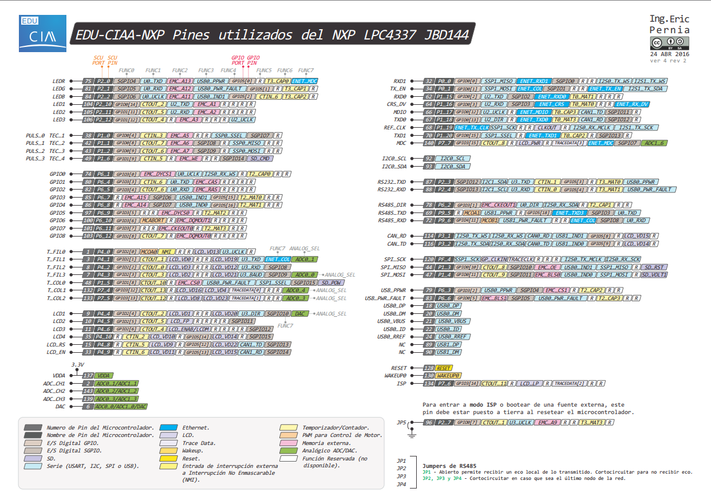
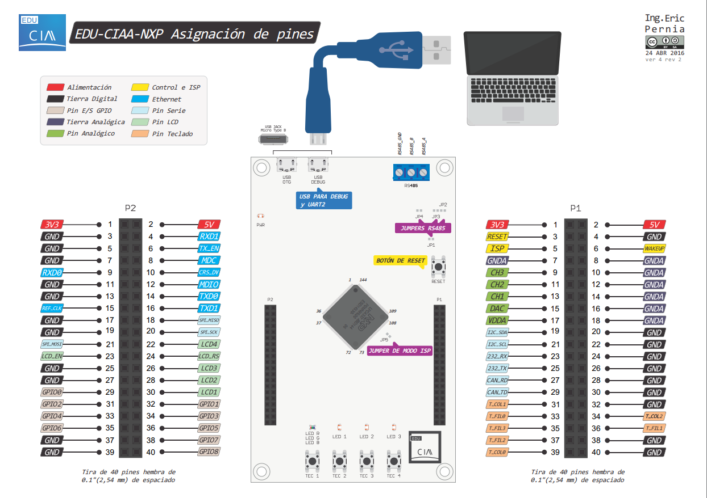

# 📘 Manual de Metodología de Mapeo: EDU-CIAA (LPC4337)

Este documento describe el procedimiento técnico para configurar cualquier pin de la placa EDU-CIAA, transformando las etiquetas físicas en código funcional bajo una arquitectura de 3 capas.

## 🖼️ Referencias Visuales y Pinout

Para facilitar el mapeo, se utilizan las siguientes capturas del pinout oficial y el diagrama de bloques de la EDU-CIAA.

### A. Mapa de Funciones y Etiquetas (Pinout)
Esta referencia permite identificar rápidamente la relación entre la serigrafía de la placa y las coordenadas del microcontrolador.



* **Columnas Naranjas:** Coordenadas para la función `Chip_SCU_PinMuxSet`.
* **Columnas Verdes:** Coordenadas para las funciones `Chip_GPIO_SetPinDIR` y `Get/SetPinState`.

### B. Ubicación Física de Periféricos (Board Layout)
Referencia visual para localizar los componentes de interfaz de usuario (LEDs y TECs) y los conectores de expansión P1/P2.



---

## 🔄 Flujo Lógico de Configuración
Para dominar el LPC4337, el programador debe entender que un pin físico es "inerte" hasta que se define su ruta interna en el silicio. El proceso sigue este orden estricto:

### 1. Fase de Identificación (Pinout)
Busca la etiqueta serigrafiada en la placa (ej: `GPIO0`). Utiliza el **Pinout oficial** para obtener las coordenadas necesarias:
* **Coordenada SCU:** (Ej: P6_1) -> Define el ruteo físico del pin.
* **Coordenada GPIO:** (Ej: GPIO3[0]) -> Define el registro lógico de control.

### 2. Fase de Mapeo Físico (Capa 1 - SCU)
Se utiliza la unidad **SCU (System Control Unit)** para conectar el pin físico con el periférico interno.
**Función:** `Chip_SCU_PinMuxSet(PORT, PIN, MODE);`

* **PORT / PIN:** Coordenadas del SCU extraídas del pinout (Ej: 6, 1).
* **MODE (Configuración Eléctrica):**
    * **FUNCn:** Selecciona la función del pin (FUNC0 a FUNC7). **FUNC0** suele ser GPIO, pero verifica siempre el pinout (Ej: el LED RGB usa FUNC4).
    * **SCU_MODE_INACT:** Sin resistencias internas (ideal para salidas).
    * **SCU_MODE_PULLUP:** Activa resistencia a 3.3V (para entradas que cierran a GND).
    * **SCU_MODE_INBUFF_EN:** **CRÍTICO**. Habilita el buffer de entrada. Sin esto, el GPIO siempre leerá '0' independientemente del estado físico.

### 3. Fase de Configuración Lógica (Capa 2 - GPIO)
Una vez ruteado el pin, se define el sentido del flujo de datos en el bloque GPIO.
**Funciones:**
* `Chip_GPIO_SetPinDIROutput(LPC_GPIO_PORT, GPIO_PORT, GPIO_PIN);`
* `Chip_GPIO_SetPinDIRInput(LPC_GPIO_PORT, GPIO_PORT, GPIO_PIN);`

* **GPIO_PORT / PIN:** Coordenadas lógicas (Ej: 3, 0).

---

## 🛠️ Ejemplo Práctico: Configurando la etiqueta "GPIO0"
Objetivo: Usar el pin etiquetado como `GPIO0` para leer un sensor externo.

### A. Datos del Pinout
* **Etiqueta:** `GPIO0`
* **SCU:** `P6_1` (Port 6, Pin 1)
* **GPIO:** `GPIO3[0]` (Port 3, Pin 0)
* **Func:** `FUNC0`

### B. Implementación
```c
// 1. Mapeo en hardware.h (Capa 1)
#define SENSOR_SCU_PORT  6
#define SENSOR_SCU_PIN   1
#define SENSOR_GPIO_PORT 3
#define SENSOR_GPIO_PIN  0

// 2. Configuración en board_init (Capa 2)
// Activamos Pull-up y Buffer de entrada (esencial para lectura)
Chip_SCU_PinMuxSet(SENSOR_SCU_PORT, SENSOR_SCU_PIN, 
                  (SCU_MODE_PULLUP | SCU_MODE_INBUFF_EN | FUNC0));

// Definimos como entrada
Chip_GPIO_SetPinDIRInput(LPC_GPIO_PORT, SENSOR_GPIO_PORT, SENSOR_GPIO_PIN);
```
---

| Objetivo Técnico | Dato del Pinout necesario | Función LPCOpen |
| :--- | :--- | :--- |
| **Conectar el cable interno** | SCU PORT / PIN | `Chip_SCU_PinMuxSet` |
| **Elegir qué hace el pin** | FUNCn | `Chip_SCU_PinMuxSet` (parámetro MODE) |
| **Definir Entrada/Salida** | GPIO PORT / PIN | `Chip_GPIO_SetPinDIR...` |
| **Operar (On/Off/Leer)** | GPIO PORT / PIN | `Chip_GPIO_SetPinState` / `GetPinState` |

---

## ⚠️ Troubleshooting: Errores Comunes

1. **El pin no cambia de estado**: Verifica si el pin requiere `FUNC4` en lugar de `FUNC0` (común en el LED RGB).
2. **La entrada siempre lee '0'**: Asegúrate de haber incluido `SCU_MODE_INBUFF_EN` en el mapeo del SCU.
3. **Confusión de coordenadas**: Recuerda que `P2_12` (SCU) **NO** es lo mismo que `GPIO2[12]`. Usa siempre el mapa de referencia.

---## 📚 Referencias y Documentación Técnica

Para el desarrollo soberano sobre la plataforma **EDU-CIAA (LPC4337)**, se han utilizado las siguientes fuentes oficiales como base de ingeniería:

1. **NXP UM10503 - LPC43xx User Manual**:
   * **Capítulo 16 (SCU)**: Detalle técnico sobre la matriz de conmutación, ruteo de señales y configuración eléctrica de los pads (Pulls, Slew-rate, Input Buffer).
   * **Capítulo 15 (GPIO)**: Descripción de los registros de dirección (DIR), estado (PIN) y manipulación atómica (SET/CLR/NOT).

2. **Esquemático EDU-CIAA-NXP (v1.1)**:
   * Documento fundamental para cruzar la serigrafía de la placa (etiquetas P1, P2, LEDs, TECs) con los pines físicos del encapsulado **JBD144**.

3. **LPCOpen Software Development Platform (v2.xx)**:
   * Drivers de capa de abstracción de periféricos (`lpc_chip_43xx`) utilizados para garantizar la portabilidad y eficiencia del código C.

4. **Cortex-M4 Technical Reference Manual (ARM)**:
   * Referencia para la gestión del núcleo, el controlador de interrupciones **NVIC** y el temporizador **SysTick**.