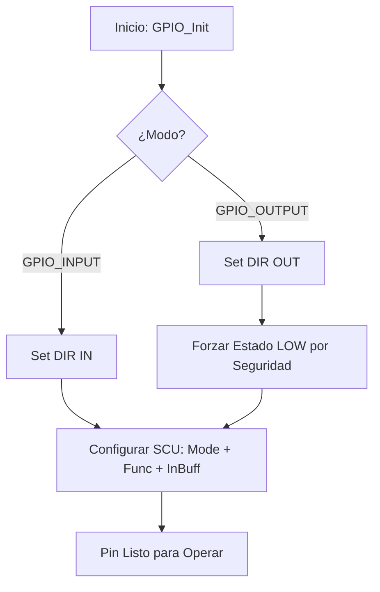

# Módulo: Driver de Abstracción GPIO (General Purpose Input/Output)

## 1. Título y Objetivos
**HAL de Bajo Nivel para la Gestión Atómica de Pines en LPC4337.**
* **Objetivo:** Abstraer la complejidad de la Matriz de Conmutación (SCU) y el periférico GPIO en una API unificada.
* **Funcionalidad:** Configuración de modos eléctricos (Pulls), muxeo de funciones y operaciones de E/S digitales no bloqueantes.

---

## 2. Teoría de Operación (SCU vs GPIO)
A diferencia de microcontroladores más simples, el LPC4337 separa la configuración física del pin de su función lógica. Este driver gestiona ambos dominios:

1.  **System Control Unit (SCU):** Configura las características eléctricas (Pull-up, Pull-down, Repeater) y conecta el pin físico con el periférico interno deseado (Función 0 para GPIO).
2.  **Input Buffer:** Se habilita por hardware mediante el bit `EZI`. Sin este bit, el registro de estado del GPIO (`PIN`) no puede leer el nivel de voltaje del pad físico.
3.  **GPIO Port:** Una vez mapeado, el periférico gestiona la dirección (`DIR`) y los datos (`SET`, `CLR`, `PIN`).

---
## 3. Arquitectura del Software (Detalle Capa 1)

Este módulo se ubica en la **Capa 1 (Hardware Mapping)**, sirviendo de base fundamental para los drivers de Capa 2 (como LED o CIAA_BOARD) y la lógica de aplicación en la Capa 3.

### **3.1. Estructura de Datos Crítica: `gpio_config_t`**

Para evitar la dispersión de datos y el uso de "números mágicos", se utiliza una estructura que vincula la **identidad física** (SCU) con la **identidad lógica** (GPIO) del pin:

```c
typedef struct {
    uint8_t  scuPort;   // Puerto de la Matriz de Conmutación (0..15)
    uint8_t  scuPin;    // Pin de la Matriz de Conmutación (0..31)
    uint16_t scuFunc;   // Función asignada (ej. SCU_MODE_FUNC0)
    uint8_t  gpioPort;  // Puerto lógico del periférico GPIO (0..7)
    uint8_t  gpioPin;   // Pin lógico del periférico GPIO (0..31)
} gpio_config_t;
```
### **3.2. Diagrama de Flujo: GPIO_Init**

El proceso de inicialización garantiza que el hardware atraviese todas las etapas de configuración (Muxeo -> Modo Eléctrico -> Dirección) de forma secuencial y segura antes de quedar disponible para el sistema.


### **3.3. Implementación de Inicialización**

La implementación utiliza la estructura **gpio_config_t** para desacoplar los parámetros físicos. El uso de **SCU_MODE_INBUFF_EN** es crítico en el LPC4337 para permitir la retroalimentación del estado real del pin hacia el registro *PIN*, permitiendo lecturas precisas incluso en configuraciones de salida.

```C
void GPIO_Init(const gpio_config_t *config, gpio_mode_t mode) {
    uint16_t scuMode = SCU_MODE_INACT;

    /* 1. Selección del modo eléctrico (Pull-up/Down/None) */
    // Determinación basada en el parámetro 'mode'...

    /* 2. Habilitación del Buffer de Entrada (Fundamental para lectura) */
    scuMode |= SCU_MODE_INBUFF_EN; 

    /* 3. Muxeo de la SCU: Combinación de Función + Modo Eléctrico */
    Chip_SCU_PinMuxSet(config->scuPort, config->scuPin, (scuMode | config->scuFunc));

    /* 4. Configuración de Dirección y Estado Inicial */
    if (mode == GPIO_OUTPUT) {
        Chip_GPIO_SetPinDIROutput(LPC_GPIO_PORT, config->gpioPort, config->gpioPin);
        GPIO_Write(config, GPIO_LOW); // Estado seguro por defecto
    } else {
        Chip_GPIO_SetPinDIRInput(LPC_GPIO_PORT, config->gpioPort, config->gpioPin);
    }
}
```

---

## 4. Detalles de Robustez

La fiabilidad del driver reside en cómo maneja el hardware a nivel de registro para evitar fallos en sistemas de tiempo real:

### **4.1. Atomicidad de Escritura (Bit-Masking)**
Las funciones `GPIO_Write` y `GPIO_Toggle` utilizan los registros de enmascaramiento de bits de la arquitectura ARM Cortex-M4. 
* **Ventaja:** Esto garantiza que la modificación de un pin específico sea una operación atómica a nivel de hardware. 
* **Impacto:** No se afecta el estado de los pines adyacentes en el mismo puerto y se elimina la necesidad de implementar "secciones críticas" (deshabilitar interrupciones), optimizando la latencia del sistema.

### **4.2. Seguridad en Inicialización (Safe State)**
Al configurar un pin como salida (`GPIO_OUTPUT`), el driver fuerza un estado `GPIO_LOW` de manera inmediata. Esto previene transitorios inesperados o "glitches" en actuadores externos (relés, drivers de motor, etc.) durante la transición de alta impedancia a salida activa.

---

## 5. Mapeo de Hardware

Este driver es una capa genérica diseñada para mapear cualquier pin físico del **LPC4337**. Su implementación práctica y definiciones constantes se encuentran centralizadas en el módulo `CIAA_BOARD`.

### **Resumen de Interfaz de Hardware**

| Operación | Macro / Función | Requisito SCU | Registro GPIO | Nivel de Acceso |
| :--- | :--- | :--- | :--- | :--- |
| **Escritura** | `GPIO_Write` | Función GPIO (0 o 4) | `SET` / `CLR` | **Atómico** |
| **Lectura** | `GPIO_Read` | **Input Buffer (EZI)** | `PIN` | Directo |
| **Alternancia** | `GPIO_Toggle` | Función GPIO | `NOT` | **Atómico** |
| **Configuración** | `GPIO_Init` | Muxing + Pulls | `DIR` | Inicialización |

---

> 🛠️ Estudiante de Ing. Electrónica @UTN_FRT | Apasionado por los Sistemas Embebidos y el Low-level (ASM/C).