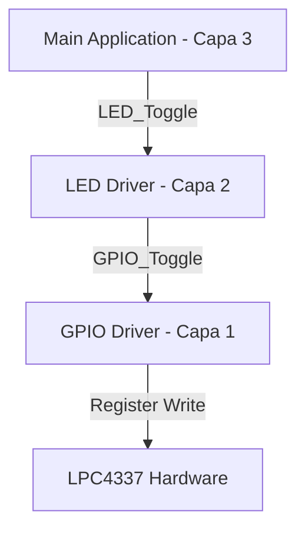

# Módulo: Driver de Abstracción de LEDs (Capa 2)

## 1. Título y Objetivos
**API de Gestión Semántica para Indicadores Visuales.**
* **Objetivo:** Abstraer el manejo de pines individuales transformándolos en un arreglo indexado de indicadores.
* **Funcionalidad:** Inicialización masiva de arreglos de salida, control de estado (Set) y alternancia (Toggle) mediante índices.

---

## 2. Teoría de Operación (Abstracción Indexada)
El driver de LED actúa como un "wrapper" sobre la HAL de GPIO. Su principal ventaja es la **desvinculación del hardware**:
1.  **Arreglo de Configuración:** Recibe un puntero a una tabla de estructuras `gpio_config_t`.
2.  **Acceso por Índice:** La lógica de aplicación (Capa 3) ya no interactúa con puertos o pines, sino con una posición en el arreglo (ej. `LED_3`), lo que facilita la portabilidad entre diferentes placas.

---

## 3. Arquitectura del Software (Detalle Capa 2)
Este módulo se ubica en la **Capa 2**, consumiendo los servicios de la Capa 1 (GPIO).

### **Jerarquía de Llamadas**


### **3.3. Implementación de Inicialización Masiva**

La función `LED_Init_Array` automatiza el proceso de configuración de múltiples periféricos de salida mediante una única llamada. Este diseño garantiza que todo el arreglo de indicadores atraviese el muxeo de la SCU y comience en un **estado conocido y seguro (Low)** antes de que el sistema inicie su lazo principal.

```c
/**
 * @brief Inicializa un arreglo de pines como salidas para LEDs.
 * @param table Puntero a la tabla de configuración (Capa 1).
 * @param count Cantidad de elementos a configurar.
 */
void LED_Init_Array(const gpio_config_t *table, uint8_t count) {
    for (uint8_t i = 0; i < count; i++) {
        /* Reutilización de la lógica soberana de Capa 1 (GPIO) */
        GPIO_Init(&table[i], GPIO_OUTPUT);
    }
}
```

---

## 4. Detalles de Robustez

La arquitectura de este módulo prioriza la fiabilidad mediante la herencia de funciones probadas y la flexibilidad estructural:

* **Reutilización de Código (Herencia de Seguridad):** Al invocar internamente a `GPIO_Init`, el driver de LED hereda automáticamente todas las protecciones implementadas en la **Capa 1**. Esto asegura que cada indicador visual atraviese un muxeo correcto de la SCU y se establezca un **Safe State** en `GPIO_LOW` de forma atómica, eliminando estados flotantes indeseados al arranque.
* **Escalabilidad Dinámica:** El diseño está desacoplado de la cantidad física de componentes. Permite gestionar desde un solo LED hasta una matriz completa o un bus de indicadores, simplemente modificando el parámetro `count` y la tabla de configuración en la capa superior, sin necesidad de alterar una sola línea de código del driver `led.c`.

---

## 5. Mapeo de Hardware

Este driver de **Capa 2** no posee un mapeo de pines estático. Su funcionamiento depende enteramente de la existencia de una tabla de configuración (`gpio_config_t`) definida generalmente en el módulo de soporte de placa **CIAA_BOARD**.

### **Dependencias de Capa:**
1.  **Capa 1 (GPIO):** Provee las primitivas de escritura y configuración.
2.  **Capa 2 (CIAA_BOARD):** Provee la instancia física (los pines reales de la EDU-CIAA).
3.  **Capa 2.5 (LED):** Provee la interfaz semántica para el usuario final.

---

> 🛠️ Estudiante de Ing. Electrónica @UTN_FRT | Apasionado por los Sistemas Embebidos y el Low-level (ASM/C).