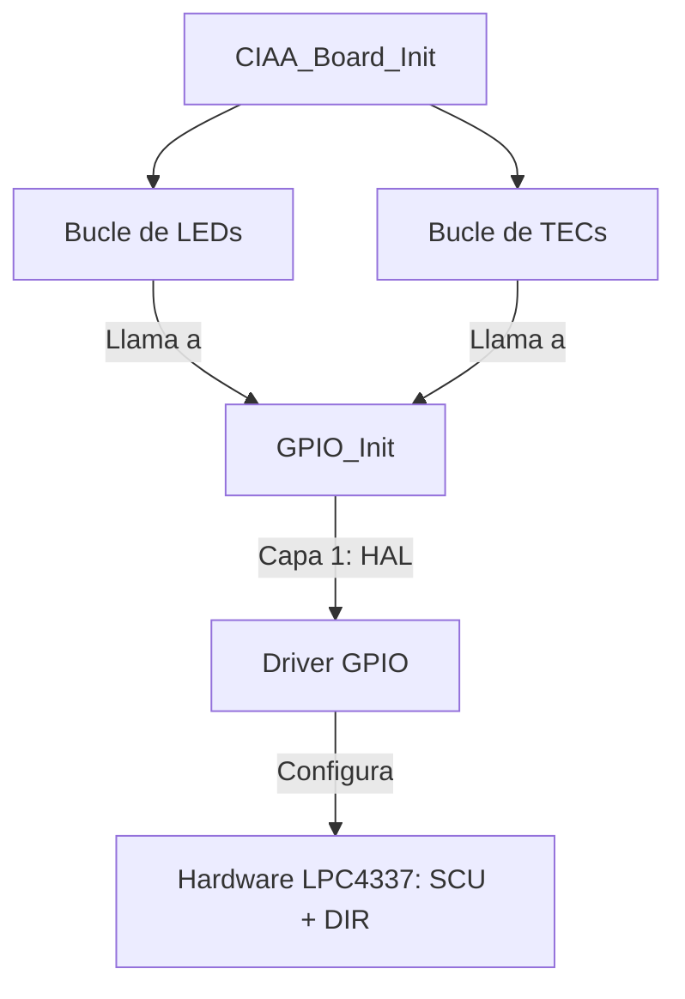

# Módulo: Board Support Package (CIAA_BOARD)

## 1. Título y Objetivos
**Capa de Adaptación de Hardware para EDU-CIAA LPC4337.**
* **Objetivo:** Centralizar el mapeo físico de los periféricos integrados de la placa (LEDs y Pulsadores).
* **Funcionalidad:** Proveer una interfaz semántica de alto nivel que oculte la complejidad de los puertos, pines y funciones de la SCU.

---

## 2. Teoría de Operación (Abstracción de Placa)
Este módulo actúa como el "Traductor" oficial entre el silicio (LPC4337) y la placa física (EDU-CIAA). Su funcionamiento se basa en **Tablas de Mapeo Estáticas**:

1.  **Desacoplamiento:** El driver de GPIO (Capa 1) es genérico. El módulo CIAA_BOARD le otorga contexto al definir qué pin es el "LED 1" o la "TEC 2".
2.  **Lógica Negativa:** Los pulsadores de la placa están conectados a masa (GND) al presionarse. El BSP documenta y gestiona esta realidad eléctrica para que la Capa 3 interprete correctamente los estados.

---

## 3. Arquitectura del Software (Detalle Capa 2)
Este módulo se ubica en la **Capa 2**, sirviendo de puente directo entre los drivers HAL y la Aplicación.

### **3.1. Tablas de Mapeo (Encapsulamiento)**
Se utilizan arreglos de estructuras `gpio_config_t` declarados como `static const` para asegurar que el mapeo sea inmutable y no ocupe espacio innecesario en la memoria RAM (se almacenan en Flash).

```c
static const gpio_config_t boardLeds[] = {
    [CIAA_LED_R] = {2, 0,  SCU_MODE_FUNC4, 5, 0}, // LED RGB Rojo
    [CIAA_LED_1] = {2, 10, SCU_MODE_FUNC0, 0, 14}, // LED 1 Rojo
    // ...
};
```
### **3.2. Jerarquía de Inicialización**

El proceso de arranque de la placa sigue una estructura de árbol, donde una única llamada a `CIAA_Board_Init()` desencadena la configuración secuencial de todos los periféricos integrados, garantizando la consistencia del hardware.

#### **Diagrama de Flujo: Inicialización de Placa**


#### **Fragmento de Código Clave (Implementación)**

La implementación utiliza iteración sobre las tablas de mapeo privadas, lo que permite que el código sea compacto y fácil de mantener si el hardware cambiara en futuras revisiones de la placa.

```C
void CIAA_Board_Init(void) {
    /* 1. Configuración de LEDs: Salidas con estado inicial seguro (LOW) */
    for (int i = 0; i < CIAA_LEDS_MAX; i++) {
        GPIO_Init(&boardLeds[i], GPIO_OUTPUT);
    }

    /* 2. Configuración de TECs: Entradas con Pull-Up y Buffer habilitado */
    for (int i = 0; i < CIAA_TECS_MAX; i++) {
        GPIO_Init(&boardTecs[i], GPIO_INPUT_PULLUP);
    }
}
```

---

## 4. Detalles de Robustez

La fiabilidad de este módulo (Capa 2) se basa en la protección de la memoria y la previsión de fallos lógicos durante la ejecución:

* **Validación de Índices (Bound Checking):** Todas las funciones de la interfaz pública (`CIAA_LED_Set`, `CIAA_LED_Toggle`, `CIAA_TEC_Get`) realizan una verificación de límites antes de acceder a las tablas de mapeo. Esto previene punteros fuera de rango y accesos a memoria no autorizada que podrían derivar en un *HardFault*.
* **Estado Seguro ante Error (Fail-Safe):** En caso de una solicitud con un índice inválido en la lectura de pulsadores, la función `CIAA_TEC_Get` devuelve por defecto `GPIO_HIGH`. Esto simula un estado "no presionado" (lógica negativa), evitando que un error de software dispare accidentalmente una acción crítica en la lógica de control.
* **Redundancia Eléctrica y EMC:** Aunque la placa EDU-CIAA cuenta con resistencias de Pull-up físicas, el BSP habilita mediante software los Pull-ups internos de la **SCU**. Esta redundancia garantiza niveles lógicos estables y una mayor inmunidad frente a ruidos electromagnéticos en entornos industriales.

---

## 5. Mapeo de Hardware (Resumen de Placa)

A continuación se resume el vínculo entre la semántica del software y la realidad física del microcontrolador LPC4337 para los periféricos integrados:

| Periférico | Etiqueta Enum | Pin SCU | Función | Puerto GPIO | Bit GPIO |
| :--- | :--- | :---: | :---: | :---: | :---: |
| **LED 1 (Rojo)** | `CIAA_LED_1` | P2_10 | FUNC0 | 0 | 14 |
| **LED 2 (Amarillo)** | `CIAA_LED_2` | P2_11 | FUNC0 | 1 | 11 |
| **LED 3 (Verde)** | `CIAA_LED_3` | P2_12 | FUNC0 | 1 | 12 |
| **LED RGB (R)** | `CIAA_LED_R` | P2_0 | **FUNC4** | 5 | 0 |
| **LED RGB (G)** | `CIAA_LED_G` | P2_1 | **FUNC4** | 5 | 1 |
| **LED RGB (B)** | `CIAA_LED_B` | P2_2 | **FUNC4** | 5 | 2 |
| **TEC 1** | `CIAA_TEC_1` | P1_0 | FUNC0 | 0 | 4 |
| **TEC 2** | `CIAA_TEC_2` | P1_1 | FUNC0 | 0 | 8 |
| **TEC 3** | `CIAA_TEC_3` | P1_2 | FUNC0 | 0 | 9 |
| **TEC 4** | `CIAA_TEC_4` | P1_6 | FUNC0 | 1 | 9 |

> **Nota:** El LED RGB requiere obligatoriamente la función `FUNC4` para ser direccionado como GPIO, a diferencia de los LEDs de usuario que utilizan `FUNC0`.

---

> 🛠️ Estudiante de Ing. Electrónica @UTN_FRT | Apasionado por los Sistemas Embebidos y el Low-level (ASM/C).