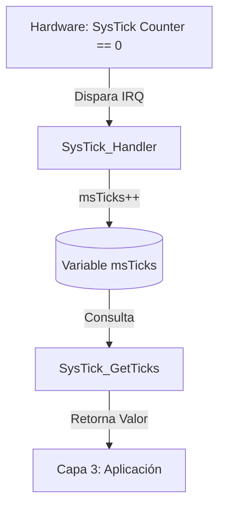

# Módulo: Driver de Temporización Determinística (SysTick)

## 1. Título y Objetivos
**HAL de Tiempo Real para la Gestión de Base de Tiempo de 1ms.**
* **Objetivo:** Implementar un metrónomo interno para el sistema utilizando el temporizador de 24 bits integrado en el núcleo ARM Cortex-M4F.
* **Funcionalidad:** Proveer marcas de tiempo (Timestamps) para el scheduler asíncrono y retardos precisos.

---

## 2. Teoría de Operación (System Tick Timer)
El SysTick es un periférico del núcleo ARM que funciona de forma independiente a los periféricos de NXP. Su operación se basa en un contador descendente:

1.  **Carga (LOAD):** Se configura con el valor `SystemCoreClock / 1000` (204.000 ciclos para 1ms a 204MHz).
2.  **Interrupción (Exc. 15):** Al llegar a cero, el hardware dispara automáticamente la interrupción `SysTick_Handler`.
3.  **Variable Soberana:** En cada interrupción, se incrementa la variable global `msTicks`, que actúa como el reloj maestro del firmware.

---

## 3. Arquitectura del Software (Detalle Capa 2)
Este módulo se ubica en la **Capa 2 (HAL)**, ya que abstrae registros del System Control Space (SCS) de ARM.

### **3.1. Protección de Datos y Optimización**
Se utiliza la calificación **`volatile`** para el contador `msTicks`. Esto le indica al compilador (GCC) que el valor de la variable puede cambiar fuera del flujo normal del programa (debido a la interrupción), forzando una lectura real de la memoria RAM en cada consulta y evitando bucles infinitos en funciones de retardo.

### **3.2. Diagrama de Flujo: `SysTick_Handler`**

### **3.3. Implementación de Retardo Seguro (Anti-Rollover)**

A diferencia de las implementaciones simplistas que fallan cuando el contador vuelve a cero, la función `SysTick_Delay` utiliza la **aritmética de diferencia en complemento a dos**. Al operar con tipos `uint32_t`, la resta garantiza un resultado absoluto coherente incluso si ocurre un desbordamiento (rollover) durante el periodo de espera.

```c
/**
 * @brief Genera un retardo bloqueante basado en ticks de sistema.
 * @note Inmune al desbordamiento de msTicks (cada ~49.7 días).
 * @param ms Cantidad de milisegundos a esperar.
 */
void SysTick_Delay(uint32_t ms) {
    uint32_t startTicks = msTicks;

    /* * Nota de Ingeniería: La resta (msTicks - startTicks) siempre devuelve 
     * el valor absoluto transcurrido correcto, protegiendo la lógica de 
     * control ante el reinicio del contador a cero.
     */
    while ((msTicks - startTicks) < ms);
}
```

---

## 4. Detalles de Robustez

La fiabilidad del sistema de tiempo real depende de la precisión y estabilidad de este módulo. Se han implementado las siguientes medidas de seguridad:

* **Inmunidad al Rollover (Desbordamiento):** Gracias al uso de tipos de datos `uint32_t` y la operación de resta aritmética, el sistema es capaz de funcionar ininterrumpidamente sin fallos de lógica temporal. Esto garantiza que, incluso cuando el contador vuelve a cero (evento que ocurre cada **~49.7 días** de operación continua), los retardos y marcas de tiempo sigan siendo precisos.
* **Encapsulamiento Atómico:** El acceso a la variable crítica `msTicks` está restringido mediante la función `SysTick_GetTicks()`. Esto protege la variable original de modificaciones accidentales desde la **Capa 3 (Aplicación)**, manteniendo la integridad del cronómetro maestro del sistema.
* **Seguridad en la Configuración:** El driver incluye una validación por software en `SysTick_Init`. Si el valor de recarga calculado excede el límite físico de **24 bits** del registro `LOAD` de ARM, el sistema entra en un bucle de diagnóstico (`while(1)`), evitando comportamientos erráticos por desbordamiento de registro.

---

## 5. Mapeo de Hardware

A diferencia de los periféricos de NXP, el **SysTick** es un recurso interno y soberano del núcleo **Cortex-M4F**. No requiere configuración en la Matriz de Conmutación (SCU), pero su precisión está ligada a la configuración del clock en el módulo `SYS_CORE`.

### **Resumen de Recursos de Tiempo**

| Recurso | Tipo de Dato / Registro | Frecuencia de Trabajo | Resolución / Tamaño |
| :--- | :--- | :---: | :---: |
| **Temporizador SysTick** | Registro de 24 bits (Hardware) | 204 MHz | 1 ms |
| **Contador msTicks** | `volatile uint32_t` (RAM) | N/A | 32 bits |

> **Nota de Ingeniería:** La estabilidad de la base de tiempo de 1ms es fundamental para el funcionamiento de los futuros módulos de comunicaciones y el scheduler cooperativo del proyecto.

---

> 🛠️ Estudiante de Ing. Electrónica @UTN_FRT | Apasionado por los Sistemas Embebidos y el Low-level (ASM/C).