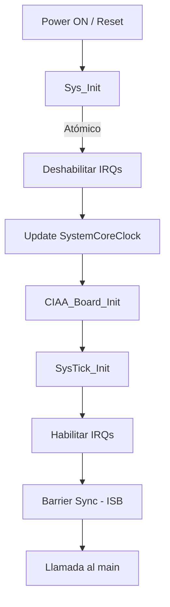

# Módulo: Control de Núcleo y Sistema (SYS_CORE)

## 1. Título y Objetivos
**Capa 0: Inicialización Soberana y Control de Bajo Nivel.**
* **Objetivo:** Centralizar la configuración crítica del hardware y el estado inicial del CPU.
* **Funcionalidad:** Gestión de relojes (PLL), sincronización del pipeline de instrucciones y control de interrupciones globales.

---

## 2. Teoría de Operación (El Tridente Crítico)
El `SYS_CORE` no es un driver de periférico, sino un **Director de Orquesta**. Su función es garantizar que el sistema pase de un estado de "Reset" a un estado de "Operación Segura" siguiendo un orden estricto:

1.  **Sincronización de Clock:** Actualiza la variable `SystemCoreClock` consultando los registros del PLL del LPC4337. Sin esto, el SysTick calcularía mal el tiempo.
2.  **Mapeo de Hardware:** Inicializa el BSP de la EDU-CIAA para que los pines tengan una identidad lógica (LEDs/TECs).
3.  **Base de Tiempo:** Arranca el metrónomo de 1ms.

---

## 3. Arquitectura del Software (Detalle Capa 0)
Este módulo reside en la base de la pirámide (**Capa 0**), siendo el único con permiso para manipular directamente registros intrínsecos del núcleo ARM.

### **3.1. Macros de Control Intrínseco**
Para evitar el uso de funciones de biblioteca pesadas, se implementan macros que mapean directamente a instrucciones de Assembly del procesador:

* `Sys_EnableInterrupts()`: Ejecuta `__enable_irq` (Instrucción `CPSIE i`).
* `Sys_BarrierSync()`: Ejecuta `isb` (Instruction Synchronization Barrier).

### **3.2. Diagrama de Flujo: `Sys_Init`**

---

## 4. Detalles de Robustez

La estabilidad de la **Capa 0** es crítica, ya que cualquier fallo en esta instancia compromete la ejecución de todas las capas superiores. Se han implementado las siguientes medidas de seguridad:

* **Inicialización Atómica:** La función `Sys_Init` bloquea las interrupciones globales al inicio del proceso. Esto garantiza que ningún evento externo (como un tick de timer o una interrupción de GPIO) interfiera con la configuración de los relojes o el muxeo de pines, evitando condiciones de carrera catastróficas durante el arranque.
* **Sincronización de Pipeline (Instrucción `ISB`):** El uso de la barrera `isb` (Instruction Synchronization Barrier) asegura que el procesador descarte cualquier instrucción precargada en su pipeline y las vuelva a buscar desde la memoria. Esto garantiza que el CPU reconozca de inmediato los cambios en la configuración del sistema, como la habilitación de interrupciones y la nueva frecuencia de reloj.
* **Respeto a la Jerarquía de Hardware:** El driver sigue un orden de dependencia estricto: primero se estabiliza la frecuencia de trabajo del PLL y luego se configuran los periféricos que dependen de dicha frecuencia (SysTick). Esto previene errores de temporización en la inicialización de los drivers de Capa 1 y 2.

---

## 5. Mapeo de Hardware

Este módulo interactúa directamente con el **NVIC** (Nested Vectored Interrupt Controller) y los registros de control del sistema de la arquitectura **ARM Cortex-M4F**.

### **Interfaz de Control de Núcleo**

| Función / Recurso | Instrucción ARM | Propósito Técnico |
| :--- | :---: | :--- |
| **Control de IRQ** | `CPSIE i` / `CPSID i` | Gestión atómica de la máscara de interrupciones globales. |
| **Sincronización** | `ISB` | Limpiar el pipeline y sincronizar el contexto del CPU. |
| **Reloj de Sistema** | `Update` | Sincronizar periféricos con el PLL configurado a 204MHz. |
| **Control NVIC** | `__enable_irq()` | Habilitar el despacho de excepciones desde el núcleo. |

---

> 🛠️ Estudiante de Ing. Electrónica @UTN_FRT | Apasionado por los Sistemas Embebidos y el Low-level (ASM/C).