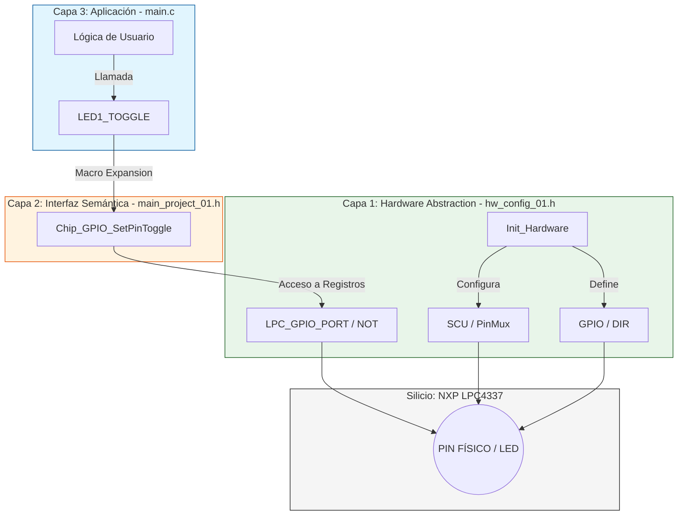

# 🚀 1. Laboratorio 01: Gestión de GPIO y Abstracción de Hardware (3-Layer Arch)

Este laboratorio constituye la base del ecosistema. Implementa el control de salidas digitales en la **EDU-CIAA (LPC4337)**, demostrando la transición de registros físicos a macros semánticas mediante una arquitectura de software robusta y desacoplada.

---

## 🛠️ 2. Teoría de Operación

El flujo de operación de este firmware se basa en la correcta secuenciación de tres etapas críticas del hardware del **LPC4337**:

### 1. Sincronización del Reloj (Clocking)
Antes de manipular cualquier registro, se invoca `SystemCoreClockUpdate()`. Esta función es vital en el ecosistema LPCOpen porque recalcula el valor de la variable `SystemCoreClock` basándose en la configuración de los divisores y el PLL del **CGU (Clock Generation Unit)**. 

* **Velocidad de Operación:** Por defecto, el núcleo **Cortex-M4** de la EDU-CIAA se configura para correr a una frecuencia máxima de **204 MHz**. 
* **Importancia:** Sin esta sincronización, cualquier lógica de delay o temporización posterior (como el parpadeo de los LEDs) tendría una deriva proporcional al error de frecuencia, ya que el compilador necesita conocer el valor exacto de ciclos por segundo para calcular los retardos de forma precisa.

### 2. Matriz de Conmutación (SCU - System Control Unit)
A diferencia de microcontroladores más simples, el LPC4337 requiere configurar la **SCU** antes de usar un pin. Cada pad físico tiene una matriz interna que permite asignar hasta 8 funciones distintas.
* **Muxing:** Mediante `Chip_SCU_PinMuxSet`, el pin físico (ej. P2_10) se conecta internamente a la función de GPIO (Función 0 en la mayoría de los LEDs de la EDU-CIAA).
* **Atributos del Pad:** Se configura el buffer de entrada/salida definiendo si el pin operará con pull-up, pull-down, o en modo "inactivo" (tri-state), además de habilitar el filtro de glitches para entradas digitales.

### 3. Registro de Dirección y Control (GPIO)
Una vez que el pin físico está conectado eléctricamente al periférico GPIO, se utiliza `Chip_GPIO_SetPinDIROutput` para configurar el registro de dirección (**DIR**). 
* **Atomicidad:** Las macros en `main_project_01.h` utilizan funciones de LPCOpen que acceden a los registros **SET**, **CLR** y **NOT** (Toggle). Esto permite manipular un bit específico sin afectar a los demás pines del mismo puerto (evitando la clásica secuencia read-modify-write y garantizando atomicidad en la operación).

---

## 🏗️ 3. Arquitectura del Software (Modelo de 3 Capas)

Para garantizar la **Soberanía Técnica**, el firmware se ha estructurado en tres niveles de abstracción:



### 🔹 Capa 1: Hardware Mapping (`hw_config_01.h`)
En esta capa se define la "Soberanía Técnica" sobre el silicio. No contiene lógica ejecutable, sino el **mapeo físico** del LPC4337 basado en el manual **UM10503**.

* **Mapeo de Pines:** Se asocian los puertos y pines físicos del SCU (ej. `P2_10`) con sus correspondientes puertos y pines del periférico GPIO (ej. `GPIO 0[14]`).
* **Abstracción de Funciones:** Se definen los modos de función del SCU según el Pinout de la EDU-CIAA:
    * `LED_FUNC` (`SCU_MODE_FUNC0`) para los LEDs externos.
    * `LEDRGB_FUNC` (`SCU_MODE_FUNC4`) para los LEDs RGB.
* **Beneficio:** Si se desea cambiar un pin, solo se modifica este archivo. El resto del firmware permanece intacto.

### 🔹 Capa 2: Interfaz Semántica (`main_project_01.h`)
Es el puente entre el hardware crudo y la aplicación. Aquí se crean las macros que utilizaremos en la lógica principal, consumiendo las definiciones de `hw_config_01.h`:

```c
// Ejemplo de abstracción para LED 1
#define LED1_ON()       Chip_GPIO_SetPinOutHigh(LPC_GPIO_PORT, LED1_GPIO_PORT, LED1_GPIO_PIN)
#define LED1_OFF()      Chip_GPIO_SetPinOutLow(LPC_GPIO_PORT, LED1_GPIO_PORT, LED1_GPIO_PIN)
#define LED1_TOGGLE()   Chip_GPIO_SetPinToggle(LPC_GPIO_PORT, LED1_GPIO_PORT, LED1_GPIO_PIN)
```

### 🔹 Capa 3: Aplicación y Configuración (`main.c`)
En el `main.c` se realiza la orquestación final. Es el punto de encuentro donde las definiciones de la **Capa 1** y las abstracciones de la **Capa 2** cobran vida para ejecutar la lógica de control:

1. **Configuración Inicial (`Board_Init`):** Se ejecutan las funciones críticas de **LPCOpen** para inicializar el silicio. En esta etapa se consumen directamente las etiquetas de `hardware.h`:
    * **`Chip_SCU_PinMuxSet`**: Establece la función del pin y el modo (usando el `OR` con `SCU_MODE_INACT` para control total del driver).
    * **`Chip_GPIO_SetPinDIROutput`**: Configura el sentido del flujo de datos.
2. **Lógica de Usuario:** Se implementa el bucle principal (`while(1)`) utilizando exclusivamente las macros definidas en `main_project_01.h`. Esto garantiza que la lógica de la aplicación sea legible, minimalista y fácil de auditar, ocultando la complejidad de los registros detrás de nombres semánticos.

```c
int main(void) {
    // Inicialización de Capa 1 y Capa 3
    SystemCoreClockUpdate();
    Board_Init(); // Configuración de SCU y GPIO usando hardware.h

    while(1) {
        // Ejecución mediante Capa 2
        LED1_TOGGLE(); 
        delay(SystemCoreClock / 20);
    }
}
```
---

## 🛡️ 4. Detalles de Robustez y Calidad de Firmware

La robustez de este laboratorio no reside solo en su funcionalidad, sino en las decisiones de diseño arquitectónico que previenen errores en tiempo de ejecución y facilitan el mantenimiento:

### 1. Aislamiento de Silicio (Hardware Encapsulation)
Se ha erradicado por completo el uso de "números mágicos" y llamadas directas a registros de memoria en las capas superiores.
* **Beneficio:** Al centralizar el acceso al hardware exclusivamente en `hw_config_01.c`, se reduce el riesgo de errores de configuración duplicada. 
* **Portabilidad:** Este aislamiento permite que el 90% del código sea agnóstico al microcontrolador. Si el proyecto migrara a otra familia (ej. de LPC4337 a un STM32), la lógica de la aplicación en `main.c` permanecería inalterada; solo se requeriría adaptar la implementación interna de la Capa 1.

### 2. Configuración Determinista mediante Sincronización de Reloj
El uso de `SystemCoreClockUpdate()` garantiza que el firmware sea consciente de su entorno temporal desde el primer ciclo de instrucción.
* **Control de Deriva:** En sistemas embebidos, los lazos de retardo (`delays`) y los baud-rates de las comunicaciones dependen directamente del cristal de cuarzo y los PLLs. Invocar esta función asegura que cualquier cálculo de tiempo posterior sea preciso y determinista, evitando comportamientos erráticos ante cambios en la fuente de reloj.
* **Gestión del Tiempo:** Delay por Ciclos de Instrucción
En este laboratorio se utiliza una función de retardo por software:

```c
static void delay(uint32_t count) {
    for(volatile uint32_t i = 0; i < count; i++);
}
```
> "En arquitectura Bare Metal sobre el LPC4337, las funciones de tiempo son servicios que el programador debe construir. Al no tener un System Tick inicializado todavía, delegamos el retardo a un bucle de consumo de ciclos (`Nop-loop`), asegurando mediante `volatile` que el compilador respete la carga de trabajo de la CPU".

### 3. Eficiencia mediante Macros Preprocesadas
En lugar de utilizar funciones de alto nivel que implican una sobrecarga de memoria (overhead) por el salto a la subrutina y el manejo del stack, se implementaron **Macros en `main.h`**.
* **Optimización de Binario:** Al ser resueltas por el preprocesador de GCC antes de la compilación, estas macros se traducen en instrucciones directas de ensamblador para manipulación de bits (**Bit-Set / Bit-Clear / Toggle**).
* **Atomicidad:** Se aprovechan los registros de hardware del LPC4337 que permiten modificar un bit sin requerir una secuencia de lectura-modificación-escritura (RMW), lo que previene condiciones de carrera (Race Conditions) si el pin fuera accedido simultáneamente por una interrupción.

### 4. Gestión de la Matriz de Conmutación (SCU Safe-Config)
La configuración del SCU incluye la desactivación de resistencias de pull-up/pull-down internas (`SCU_MODE_INACT`) para los LEDs. Esto asegura que el estado eléctrico de la salida sea controlado puramente por el driver del microcontrolador, minimizando el consumo de corriente residual y garantizando que el LED se apague por completo al llevar la salida a un estado lógico bajo.

`Chip_SCU_PinMuxSet(LEDR_SCU_PORT, LEDR_SCU_PIN, (SCU_MODE_INACT | LEDRGB_FUNC));`

---

## 📋 5. Mapeo de Hardware (EDU-CIAA)

| Periférico | Pin Físico (SCU) | Puerto GPIO | Pin GPIO | Función |
| :--- | :--- | :--- | :--- | :--- |
| **LED 1** | P2_10 | 0 | 14 | Salida Digital |
| **LED 2** | P2_11 | 1 | 11 | Salida Digital |
| **LED 3** | P2_12 | 1 | 12 | Salida Digital |
| **LED RGB Rojo** | P2_0 | 5 | 0 | Salida Digital |
| **LED RGB Verde** | P2_1 | 5 | 1 | Salida Digital |
| **LED RGB Azul** | P2_2 | 5 | 2 | Salida Digital |

---

## 📚 6. Referencias y Herramientas

La ejecución de este laboratorio y el desarrollo del ecosistema se apoyan en la siguiente documentación técnica y stack de herramientas:

### 📖 Documentación Técnica
* **NXP LPC43xx User Manual (UM10503):** Guía definitiva de registros, mapa de memoria y configuración de periféricos (SCU, GPIO, CGU).
* **LPCOpen Software Development Platform:** Documentación de la API para la abstracción de periféricos del LPC4337.
* **Cortex-M4 Technical Reference Manual:** Detalles de la arquitectura del núcleo, conjunto de instrucciones Thumb-2 y gestión del SysTick.
* **Esquemático EDU-CIAA NXP:** Referencia para el mapeo físico de los pines y la interfaz de potencia de los LEDs.

### 🔗 Enlaces de Interés
* [Proyecto CIAA - Sitio Oficial](http://www.proyecto-ciaa.com.ar/)
* [Repositorio LPCOpen (NXP)](https://www.nxp.com/design/software/development-software/lpcopen-libraries:LPCOPEN)
* [Documentación GNU Make](https://www.gnu.org/software/make/manual/)

---

💻 *"La autonomía en el aprendizaje permite transformar un pedazo de silicio en una solución de ingeniería; con 204MHz y una arquitectura robusta, el límite de la EDU-CIAA lo pone nuestra curiosidad."*

> 🛠️ **Carlos** | Estudiante de 4° año de Ing. Electrónica @UTN_FRT  
> 🚀 Apasionado por los Sistemas Embebidos, Firmware Engineering y el Low-level (ASM/C).