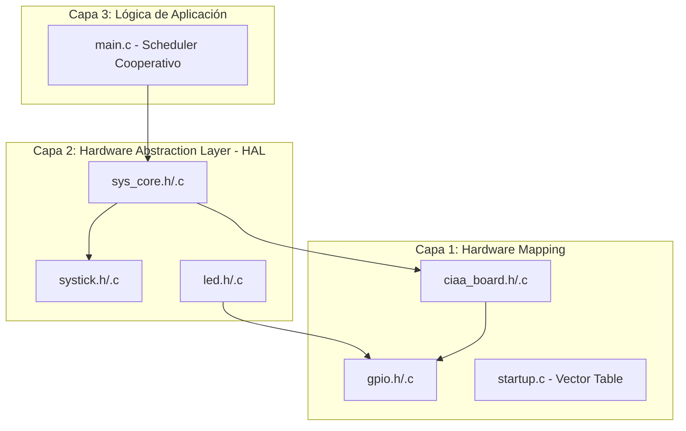

# 🚀 1. Laboratorio 02: Ecosistema de Drivers y Planificación de Tareas sobre LPC4337

**Desarrollo de un Ecosistema de Drivers (API) de 3 Capas sobre LPCOpen para el Control Determinístico y Planificación de Tareas en el Microcontrolador ARM Cortex-M4F.**

### **Objetivos Técnicos del Proyecto**
El propósito central de este desarrollo es la creación de cinco módulos de software (Drivers) que abstraen la complejidad del hardware de la EDU-CIAA, permitiendo una programación modular, escalable y soberana sobre el silicio.

#### **Desarrollo de Drivers de Abstracción (API):**
* **Driver GPIO (General Purpose Input/Output):** Capa de gestión de registros de bajo nivel para la configuración de dirección (E/S) y ejecución de operaciones atómicas de lectura y escritura de pines.
* **Driver LEDS:** Interfaz de usuario para el control de señales visuales que abstrae la lógica de hardware mediante funciones de **Set** (estado absoluto) y **Toggle** (conmutación de estado).
* **Driver SYSTICK:** Motor de tiempos dual que gestiona retardos **bloqueantes** (para procesos de inicialización crítica) y **no bloqueantes** (basados en ticks de 1ms) para la orquestación de tareas concurrentes.
* **Driver CIAA_BOARD:** Gestor de mapeo de hardware nativo. Encargado de la configuración del **SCU (System Control Unit)** para los 6 LEDs y los 4 pulsadores integrados, incluyendo la gestión de resistencias de Pull-up.
* **Driver SYS_CORE:** Orquestador maestro del sistema. Garantiza la **sincronización del SysTick** con el reloj de CPU (204MHz), la actualización de la frecuencia de core y la habilitación segura de interrupciones globales.

#### **Introducción a los Planificadores (Scheduler Cooperativo):**
Como ejemplo de aplicación práctica de estos drivers, el proyecto implementa un **Planificador de Tareas No Bloqueante**. Este sistema demuestra la capacidad de gestionar múltiples procesos en un "paralelo" aparente, optimizando el uso del CPU:

1.  **Tres Tareas de Heartbeat:** Gestión independiente de tres LEDs (Rojo, Amarillo, Verde) con periodos de alternancia diferenciados (250ms, 500ms y 1000ms).
2.  **Tarea de Entrada Crítica:** Lectura y filtrado digital de un pulsador para realizar el **Toggle** de un cuarto LED (Azul), utilizando lógica de flancos y validación temporal de 50ms para evitar rebotes (Debounce) sin afectar el determinismo de los procesos anteriores.

---

## 🛠️ 2. Teoría de Operación y Fundamentos de Bajo Nivel

La arquitectura del firmware se fundamenta en la transición de estados del procesador ARM Cortex-M4F, desde la extracción del *Stack Pointer* hasta la ejecución del *Thread Mode* en el `main`.

### **2.1. El Eslabón Perdido: Anatomía del `startup.c`**
El proceso de booteo no es una "caja negra"; es una secuencia de gestión de memoria y registros crítica para la estabilidad del sistema:

* **Vector Table & NVIC Alignment:** La Tabla de Vectores es un mapa de saltos que debe estar alineado en la memoria Flash (`0x1A000000`). Contiene el puntero inicial del **MSP (Main Stack Pointer)** y las direcciones de los *Handlers*. Sin la definición explícita del `SysTick_Handler` en esta tabla, el **NVIC (Nested Vectored Interrupt Controller)** dispararía una excepción de `HardFault` al intentar ejecutar una interrupción de un vector no inicializado.
* **Secciones de Memoria (LMA vs VMA):** * El `Reset_Handler` realiza el copiado de la sección **.data** (variables globales inicializadas) desde la Flash (LMA) a la RAM (VMA). 
    * Posteriormente, inicializa la sección **.bss** (variables en cero) mediante un loop de *zero-fill*. 
    * Este paso es vital: sin él, tus contadores de `msTicks` o los estados de los LEDs comenzarían con valores aleatorios (basura) residentes en la RAM tras el encendido.


### **2.2. Jerarquía de Drivers (Soberanía sobre LPCOpen)**
El diseño se basa en la abstracción de registros mediante el uso de punteros a estructuras definidas en el CMSIS:

* **`sys_core` (System Orchestrator):** Su función es garantizar que el `SystemCoreClock` (variable global de CMSIS) sea consistente con la configuración del PLL del LPC4337 (204MHz). Actúa como la barrera de sincronización: deshabilita las IRQs durante la configuración crítica y las habilita solo cuando el entorno es estable mediante instrucciones intrínsecas (`__enable_irq`).
* **`systick` (Time Base Generator):** Utiliza el contador decreciente de 24 bits del núcleo. Se configura para generar una excepción de sistema cada vez que el registro `VAL` alcanza cero, disparando el `SysTick_Handler`. Este manejador incrementa una variable de tipo `volatile uint32_t`, garantizando que el compilador no optimice (elimine) los accesos a dicha variable en el loop principal.

### **2.3. Implementación del Planificador (Cooperative Scheduler)**
En lugar de un paradigma secuencial bloqueante, se implementa una **Planificación por División de Tiempo (Time-Slicing)**. 

1. **Determinismo:** Cada tarea en el `main.c` se evalúa mediante una resta aritmética protegida contra el desbordamiento (Overflow-Safe): `(CurrentTick - PreviousTick) >= Period`.
2. **Concurrencia Aparente:** Al ser tareas de ejecución rápida (Atomic Tasks), el CPU puede atender el *Polling* del botón y los tres *Heartbeats* de los LEDs en el mismo milisegundo, simulando un procesamiento paralelo sin la sobrecarga (overhead) de un RTOS.

### **2.4. Robustez en I/O (Debounce por Software)**
El driver `ciaa_board` junto con la lógica de aplicación implementa un filtrado digital. Dado que la EDU-CIAA posee un filtro RC físico, el software actúa como una **segunda etapa de validación**. Al detectar un flanco de subida (*On-Release*), el sistema verifica que la señal se haya mantenido estable durante un intervalo $\Delta t > 50ms$, discriminando ruidos espurios de la acción real del usuario.

---

## 🏗️ 3. Arquitectura del Software (Modelo de 3 Capas)

El firmware se ha diseñado bajo un modelo de capas para garantizar el desacoplamiento entre la lógica de aplicación y los registros del procesador. Cada módulo posee su propia documentación técnica detallada en el directorio `/doc`.

### **3.1. Jerarquía de Dependencias (Mermaid)**


### **3.2. Detalle de Módulos (Drivers)**

| Módulo | Capa | Responsabilidad Técnica | Documentación |
| :--- | :---: | :--- | :--- |
| **SYS_CORE** | 2 | Sincronización de `SystemCoreClock` (204MHz) e inicialización atómica de periféricos críticos. | [SYS_CORE](../../docs/05-sys_core/) |
| **SYSTICK** | 2 | Gestión de la excepción de sistema (Exc. 15) del Cortex-M4 para establecer la base de tiempo de 1ms. | [SYSTICK](../../docs/04-systick/) |
| **GPIO** | 1 | Interfaz de bajo nivel para acceso directo a registros `LPC_GPIO_PORT` (SET, CLR y DIR). | [GPIO](../../docs/01-gpio/) |
| **CIAA_BOARD** | 1 | Configuración del multiplexado de pines (**SCU**) y activación de resistencias de Pull-up/Pull-down nativas. | [CIAA_BOARD](../../docs/03-ciia_board/) |
| **LED** | 2 | Abstracción de señales visuales mediante funciones lógicas de estado (**Set** y **Toggle**). | [LED](../../docs/02-led/) |

### **3.3. Ejemplo de Implementación: Capa 3 (Application)**

En el `main.c`, se implementa un **Scheduler Cooperativo**. La planificación de tareas se realiza mediante la consulta asíncrona del contador de ticks generado por el driver **SYSTICK**, eliminando por completo el uso de retardos bloqueantes y optimizando el ancho de banda del CPU:

```c
/* * Ejemplo de Tarea de Heartbeat (LED Verde - Periodo: 1000ms)
 * La resta aritmética garantiza robustez ante el desbordamiento (rollover) de los ticks.
 */
if ((SysTick_GetTicks() - lastToggleTime3) >= 1000) {
    lastToggleTime3 = SysTick_GetTicks(); // Actualización del timestamp
    CIAA_LED_Toggle(CIAA_LED_3);          // Ejecución de la acción atómica
}
```
### **3.4. Gestión de Eventos Asíncronos (Pulsadores)**

Para la interacción con el usuario, se implementa una lógica de **Detección de Flanco de Subida (On-Release)** con filtrado temporal (Debouncing). Esta técnica garantiza que la acción se ejecute una única vez por pulsación y solo cuando la señal mecánica se ha estabilizado, evitando disparos erráticos producto del ruido metálico.

#### **Implementación Técnica:**
A diferencia de los LEDs, que poseen un periodo fijo, el pulsador se gestiona mediante la comparación de estados (*Current vs Previous*) y el registro de un `timestamp` inicial al detectar la presión:

```c
/* --- Tarea de Entrada: Pulsador TEC 1 (Capa 3) --- */
bool btn_now = (CIAA_TEC_Get(CIAA_TEC_1) == GPIO_LOW); // Lógica invertida (Pull-up)

// 1. Detección de Flanco de Bajada (Dedo presiona el botón)
if (btn_now && !btn_prev_state) {
    btn_press_start_tick = SysTick_GetTicks();
}

// 2. Detección de Flanco de Subida (Dedo suelta el botón)
if (!btn_now && btn_prev_state) {
    // Validación temporal: ¿El pulso duró más de 50ms?
    if ((SysTick_GetTicks() - btn_press_start_tick) >= 50) {
        CIAA_LED_Toggle(CIAA_LED_B); // Acción soberana: Conmutar LED Azul
    }
}
btn_prev_state = btn_now; // Actualización del estado previo
```

---

## 🛡️ 4. Detalles de Robustez y Calidad de Firmware

La fiabilidad del sistema no depende solo de la lógica algorítmica, sino de la previsión de fallos de hardware y desbordamientos de memoria. Se han implementado los siguientes mecanismos de seguridad:

### **4.1. Aritmética de Ticks (Protección contra Overflow)**
El contador `msTicks` es una variable de 32 bits que se desborda aproximadamente cada 49.7 días. Para evitar que el sistema se bloquee al volver a cero, se utiliza la **propiedad de la resta en complemento a dos**:

$$(t_{actual} - t_{anterior}) \geq \text{Periodo}$$

Incluso si $t_{actual}$ es menor que $t_{anterior}$ (debido al desborde), el resultado de la resta en C (usando tipos `uint32_t`) siempre devolverá la diferencia correcta de tiempo, garantizando la continuidad del servicio sin necesidad de reinicios manuales.

### **4.2. Filtrado Digital de Transitorios (Debounce)**
Dado que los pulsadores mecánicos generan rebotes (oscilaciones de voltaje) al cerrar el contacto, se implementó una estrategia de **Validación por Ventana Temporal**:
* **Aislamiento de Flanco:** La acción solo se dispara en la transición de soltar el botón (*Release*).
* **Filtro RC + Software:** Se aprovecha el filtro físico de la EDU-CIAA para ruidos de alta frecuencia, mientras que el software garantiza que el contacto sea firme (estable por más de 50ms) antes de conmutar el estado del LED Azul.

### **4.3. Calificación de Variables (Uso de `volatile`)**
La variable `msTicks` compartida entre el `SysTick_Handler` (Contexto de Interrupción) y el `main` (Contexto de Thread) ha sido declarada como `volatile`. Esto impide que el compilador realice optimizaciones agresivas que podrían "cachear" el valor de la variable en registros del CPU, asegurando que el loop principal siempre lea el valor real actualizado en la memoria RAM.

### **4.4. Barreras de Memoria y Sincronización**
En el driver `sys_core`, se utilizan instrucciones intrínsecas del ARM Cortex-M4 para garantizar que la configuración del reloj y el NVIC se asienten antes de habilitar las interrupciones globales:
* **Atomicidad:** El acceso a los flags de interrupción se realiza de forma atómica para evitar condiciones de carrera (*Race Conditions*) durante el proceso de booteo.

---

## 📋 5. Mapeo de Hardware (EDU-CIAA)

El diseño de los drivers `ciaa_board` y `hw_config` se basa en la correspondencia física entre los pines del microcontrolador NXP LPC4337 y la serigrafía de la placa EDU-CIAA. A continuación, se detallan los recursos utilizados en este proyecto:

### **5.1. Periféricos Nativos (CIAA_BOARD)**

| Periférico | Pin Físico (BGA) | Función SCU | Puerto GPIO | Bit GPIO | Registro de Control |
| :--- | :---: | :---: | :---: | :---: | :--- |
| **LED 1 (Rojo)** | P2_10 | FUNC0 | 0 | 14 | `LPC_GPIO_PORT->DIR[0]` |
| **LED 2 (Amarillo)**| P2_11 | FUNC0 | 1 | 11 | `LPC_GPIO_PORT->DIR[1]` |
| **LED 3 (Verde)** | P2_12 | FUNC0 | 1 | 12 | `LPC_GPIO_PORT->DIR[1]` |
| **LED RGB (Rojo)** | P2_0 | FUNC4 | 5 | 0 | `LPC_GPIO_PORT->DIR[5]` |
| **LED RGB (Verde)** | P2_1 | FUNC4 | 5 | 1 | `LPC_GPIO_PORT->DIR[5]` |
| **LED RGB (Azul)** | P2_2 | FUNC4 | 5 | 2 | `LPC_GPIO_PORT->DIR[5]` |
| **TEC 1** | P1_0 | FUNC0 | 0 | 4 | `LPC_GPIO_PORT->PIN[0]` |

### **5.2. Notas de Configuración**
* **Lógica Invertida:** Los pulsadores (`TEC_x`) están conectados con resistencias de Pull-up externas y filtrado RC. La lectura lógica `0` (LOW) indica presión, mientras que `1` (HIGH) indica reposo.
* **Multiplexación (SCU):** Es imperativo configurar el registro de control de cada pin (System Control Unit) antes de manipular el GPIO. Por ejemplo, para el LED RGB Azul, se debe asegurar que el pin `P2_2` esté en `MODE 4`.

---

## 📚 6. Conclusión y Referencias

### **6.1. Conclusión Técnica**
La implementación de este ecosistema de drivers sobre el **LPC4337** demuestra que la eficiencia en sistemas embebidos no reside únicamente en el uso de librerías de fabricante, sino en la capacidad de abstraer el hardware mediante una **arquitectura de software soberana**. 

Al separar las responsabilidades en capas (Capa 1: Mapeo, Capa 2: HAL, Capa 3: Aplicación) y garantizar un booteo controlado mediante el `startup.c`, se ha logrado un sistema:
* **Determinístico:** Gracias al uso del temporizador **SysTick** como metrónomo del sistema.
* **No Bloqueante:** Permitiendo que múltiples tareas convivan sin interferencias, sentando las bases para la implementación futura de un **RTOS (Real Time Operating System)**.
* **Escalable:** La estructura modular permite integrar nuevos sensores o actuadores (vía `hw_config`) sin modificar la lógica central del planificador.

Este proyecto representa el cimiento fundamental para desarrollos de mayor complejidad, donde el control preciso del tiempo y la robustez de las entradas son críticos para el éxito de la misión.

### **6.2. Referencias y Bibliografía**
* **NXP Semiconductors:** *LPC43xx User Manual (UM10503)*.
* **ARM Limited:** *Cortex-M4 Technical Reference Manual*.
* **LPCOpen Software Development Platform:** *LPC18xx/43xx LPCOpen v2.xx*.
* **CMSIS (Cortex Microcontroller Software Interface Standard):** *Core Register Definitions and Access Functions*.
* **CIAA Project:** *Documentación Técnica de la Placa EDU-CIAA-NXP*.

---

💻 **"La verdadera ingeniería no reside en la velocidad del reloj, sino en la jerarquía del diseño. Con una arquitectura de 3 capas y una base de tiempo determinística, hemos transformado el silicio en un sistema inteligente; en la EDU-CIAA, la robustez del firmware es el reflejo de nuestra soberanía técnica."**

> 🛠️ Estudiante de Ing. Electrónica @UTN_FRT | Apasionado por los Sistemas Embebidos y el Low-level (ASM/C).