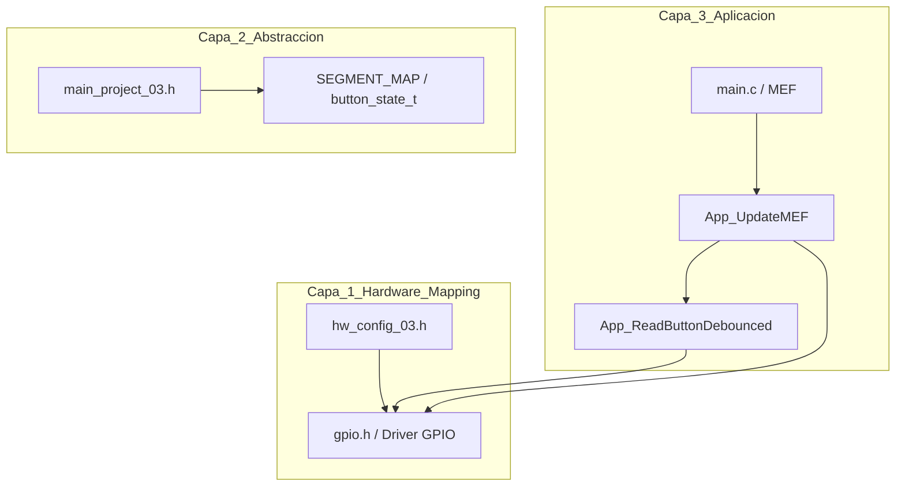

# 03_External_Counter_MEF - Contador Industrial con Antirrebote y Blink

## 1. Título y Objetivos
Este proyecto implementa un **Contador de Eventos Industrial** utilizando la placa EDU-CIAA-NXP (LPC4337). El enfoque principal es la transición de periféricos *on-board* a componentes externos, consolidando una **Arquitectura de 3 Capas** y una **Máquina de Estados Finitos (MEF)** robusta.

**Objetivos Técnicos:**
* Control de un **Display de 7 Segmentos (Cátodo Común)** mediante un bus de datos externo en el Puerto 6.
* Implementación de **Antirrebote (Debounce) No Bloqueante** y reentrante para múltiples entradas.
* Gestión de estados lógicos complejos (Play, Pause, Reset) con feedback visual de parpadeo (**Blink**).

---

## 2. Teoría de Operación (MEF y Tiempos)
El sistema opera de forma asíncrona utilizando el **SysTick** como base de tiempo (1ms). La lógica de control reside en una MEF que evita el uso de funciones bloqueantes (`delay`), permitiendo que el sistema sea reactivo a las entradas en todo momento.

### Estados de la MEF:
* **IDLE:** Estado inicial, display en `0`.
* **COUNTING:** Incremento automático cada **1000ms**.
* **PAUSED:** El conteo se detiene y el display parpadea cada **500ms** para indicar el estado de espera.
* **RESET:** Prioridad absoluta. Reinicia el conteo y vuelve a IDLE.

---

## 3. Arquitectura del Software
Se respeta la jerarquía de capas para garantizar la portabilidad del firmware:

### ** Detalle de Implementación**

* **Capa 1 (Hardware Mapping):** Mapeo de pines en `hw_config_03.h` utilizando la estructura `gpio_config_t`. Se define la relación técnica entre el SCU y los canales GPIO del microcontrolador.
* **Capa 2 (Abstracción):** Definición de tipos de datos, constantes de tiempo y la **Look-Up Table (LUT)** de segmentos en `main_project_03.h` para la decodificación de 7 segmentos.
* **Capa 3 (Aplicación):** Lógica de alto nivel en `main.c`, encargada de gestionar la **MEF**, las transiciones de estados y la actualización selectiva del display.

---

### **4. Detalles de Robustez**

* **Antirrebote por Referencia:** La función `App_ReadButtonDebounced` recibe un puntero a una estructura `button_state_t`. Esto garantiza que cada pulsador externo posea su propia memoria de tiempo, evitando interferencias y permitiendo una ejecución reentrante y escalable.
* **Higiene de Bus:** Se implementó una lógica de **"escritura por cambio"**. El hardware de salida solo se actualiza cuando el valor del contador varía o ante una transición de estado, optimizando el consumo energético y reduciendo el ruido electromagnético (EMI).
* **Aritmética de Ticks:** Las comparaciones temporales utilizan la diferencia de marcas de tiempo ($currentTick - lastTick$), asegurando un funcionamiento determinístico incluso ante el desbordamiento (*overflow*) del contador del sistema.

---

### **5. Mapeo de Hardware (Conector P2 y P1)**

#### **Display de 7 Segmentos (Cátodo Común)**
| Segmento | Pin SCU | Canal GPIO | Conexión Física | Serigrafia EDUCIAA |
| :--- | :--- | :--- | :--- | :--- |
| **Seg A** | P6_1 | GPIO3[0] | Display Pin 7 | GPIO0 |
| **Seg B** | P6_5 | GPIO3[4] | Display Pin 6 | GPIO2 |
| **Seg C** | P6_8 | GPIO5[15] | Display Pin 4 | GPIO4 |
| **Seg D** | P6_10 | GPIO3[6] | Display Pin 2 | GPIO6 |
| **Seg E** | P6_4 | GPIO3[3] | Display Pin 1 | GPIO1 |
| **Seg F** | P6_7 | GPIO5[14] | Display Pin 9 | GPIO3 |
| **Seg G** | P6_9 | GPIO3[5] | Display Pin 10 | GPIO5 |
| **DP** | P6_11 | GPIO3[7] | Display Pin 5 | GPIO7 |

#### **Pulsadores Externos**
| Función | Pin SCU | Canal GPIO | Serigrafia EDUCIAA | Configuración |
| :--- | :--- | :--- | :--- |:--- |
| **START / PAUSE** | P1_5 | GPIO1[8] | T_COL0 | Entrada con Pull-Up Interno |
| **RESET** | P4_2 | GPIO2[2] |T_FIL2 | Entrada con Pull-Up Interno |

---

### **6. Conclusión**

Este proyecto consolida el manejo de lógica de estados en sistemas embebidos de alta confiabilidad. La **separación clara** entre el mapeo de hardware y la aplicación permite que el firmware sea altamente portátil y escalable, facilitando futuras iteraciones como la multiplexación de múltiples dígitos o la integración de protocolos de comunicación industrial.

---

💻 **"La ingeniería trasciende la placa cuando el firmware domina el hardware externo. Con una MEF no bloqueante y una arquitectura de 3 capas, hemos convertido impulsos mecánicos en un sistema de control industrial reactivo; en la EDU-CIAA, la precisión del diseño es el cimiento de nuestra soberanía técnica."**

> 🛠️ **Carlos** | Estudiante de 4° año de Ing. Electrónica @UTN_FRT  
> 🚀 Apasionado por los Sistemas Embebidos, Firmware Engineering y el Low-level (ASM/C).