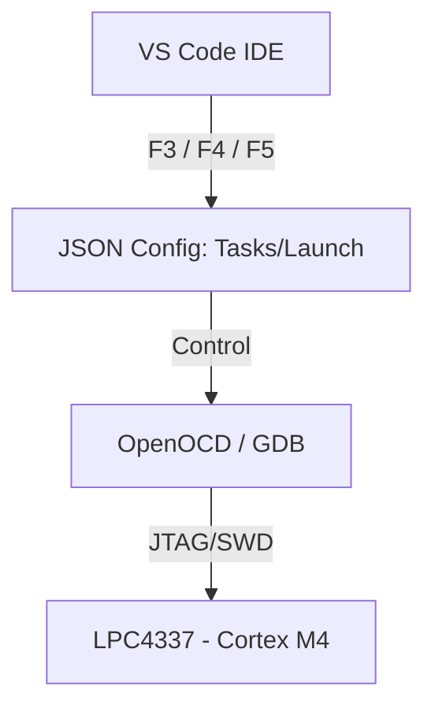

# 🛠️ Infraestructura del Toolchain y Orquestación (VS Code)

Este documento describe la configuración de la **Capa 1 (Herramientas)** y la **Capa 2 (Automatización)** para el desarrollo profesional sobre la EDU-CIAA (LPC4337).

## 🎯 Objetivos de la Infraestructura
* Establecer un entorno de compilación **GCC Arm** local y portable.
* Automatizar ciclos de Build/Flash mediante atajos de teclado.
* Estabilizar la depuración JTAG/SWD eliminando el **Error de Protocolo FC**.

---

## 🏗️ Arquitectura del Entorno



### 🧱 1. Capa 1: Binarios y Herramientas Locales
Para asegurar la **reproducibilidad** y evitar conflictos entre versiones de compiladores, se utilizan herramientas locales. Esto permite que el proyecto sea portable: basta con copiar la carpeta para que funcione en cualquier PC sin necesidad de modificar las variables de entorno del sistema (`PATH`).

* **Compilador:** `tools/gcc-arm/bin/arm-none-eabi-gcc`
    * *Función:* Transforma el código C en instrucciones binarias optimizadas para la arquitectura Cortex-M4.
* **Depurador:** `tools/openocd/bin/openocd.exe`
    * *Función:* Actúa como puente de comunicación (GDB Server) entre el IDE y la interfaz JTAG de la EDU-CIAA.
* **SVD (System View Description):** `misc/LPC43xx_43Sxx.svd`
    * *Función:* Diccionario XML que mapea las direcciones de memoria física a nombres de registros legibles (SCU, GPIO, Timers) en el IDE.


### ⚙️ 2. Capa 2: Automatización (.vscode)
En este nivel orquestamos las herramientas de la Capa 1 mediante archivos de configuración de Visual Studio Code para estandarizar el flujo de trabajo.

#### 📄 `launch.json` (Configuración de Depuración)
Esta es la pieza crítica de **Robustez** del entorno. Se configuró un **Bypass de Reset** y un aislamiento del target para mitigar el error de protocolo **FC** (causado por la falta de respuesta del co-procesador Cortex-M0 durante el handshake JTAG).

```json
{
    "version": "0.2.0",
    "configurations": [
        {
            "name": "Debug EDU-CIAA (Local Toolchain)",
            "type": "cortex-debug",
            "request": "launch",
            "servertype": "openocd",
            "executable": "${workspaceFolder}/out/01_GPIO_SCU_Mux.elf",
            "serverpath": "${workspaceFolder}/tools/openocd/bin/openocd.exe",
            "armToolchainPath": "${workspaceFolder}/tools/gcc-arm/bin",
            "cwd": "${workspaceFolder}",
            "configFiles": ["${workspaceFolder}/lpc4337_new.cfg"],
            "searchDir": ["${workspaceFolder}/tools/openocd/openocd/scripts"],
            "svdFile": "${workspaceFolder}/misc/LPC43xx_43Sxx.svd",
            "overrideLaunchCommands": [
                "monitor halt",
                "monitor targets lpc4337.m4",
                "load",
                "tbreak main"
            ],
            "runToEntryPoint": "main",
            "preLaunchTask": "MAKE ALL",
            "showDevDebugOutput": "none"
        }
    ]
}
```

#### 📄 tasks.json (Tareas de Build)

```json
{
    "version": "2.0.0",
    "tasks": [
        {
            "label": "MAKE ALL",
            "type": "shell",
            "command": "make all",
            "group": { "kind": "build", "isDefault": true }
        }
    ]
}
```

## 🛡️ Detalles de Robustez y Troubleshooting

Para asegurar una experiencia de desarrollo estable en la **EDU-CIAA**, se implementaron las siguientes medidas de seguridad técnica:

* **Bypass de Error FC:** Se eliminó la instrucción `monitor reset halt` del flujo de inicio. Esto evita que el JTAG intente sincronizar el núcleo **M0** (coprocesador), cuya falta de respuesta disparaba *timeouts* de protocolo y bloqueaba la sesión de GDB.
* **Limpieza de Procesos:** Si el driver FTDI se bloquea o el puerto está "ocupado", es probable que exista una instancia de OpenOCD huérfana. Ejecutar en la terminal de VS Code:
    ```bash
    taskkill /F /IM openocd.exe
    ```
* **Validación de Capa 1:** El uso del archivo **SVD** permite realizar una auditoría de registros del **SCU** (System Control Unit) y **GPIO_PORT** en tiempo real. Esto permite validar la configuración del hardware desde la pestaña **XPERIPHERALS** de VS Code sin necesidad de osciloscopio para pruebas lógicas básicas.


---

## ⌨️ Mapeo de Atajos (Productividad)

Se han configurado los siguientes *Keybindings* para optimizar el ciclo de desarrollo "Code-Build-Debug":

| Tecla | Función | Descripción |
| :--- | :--- | :--- |
| **F3** | **Build** | Dispara la tarea `MAKE ALL`. Realiza una compilación incremental usando el Makefile. |
| **F4** | **Flash** | Ejecuta `MAKE DOWNLOAD`. Graba el binario en la Flash mediante OpenOCD sin iniciar el depurador. |
| **F5** | **Debug** | Inicia la sesión de GDB, carga los símbolos, el archivo SVD y detiene la ejecución en `main()`. |

---

*Un Toolchain independiente es la garantía de que el conocimiento pertenece al desarrollador y no a la herramienta."*

 💻 **Desarrollo de Sistemas Embebidos Profesionales**
